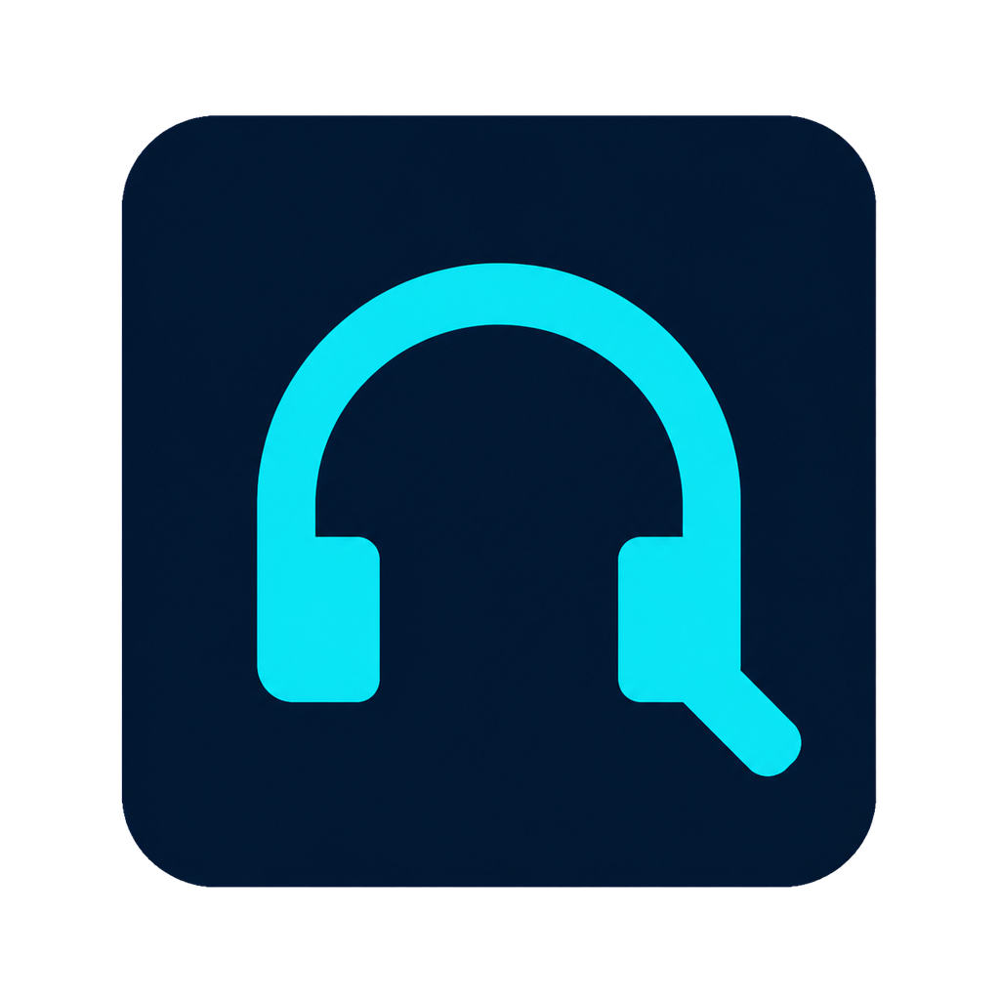
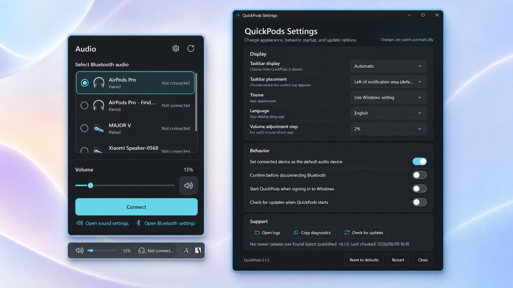

  

<h1 align="center">QuickPods</h1>

  Windows 11のタスクバーから、音量とペアリング済みBluetoothオーディオをすばやく操作するアプリです。

  <a href="README.md">English</a> ·
  <a href="docs/user-guide.md">ユーザーガイド</a> ·
  <a href="docs/development.md">開発ガイド</a> ·
  <a href="CONTRIBUTING.md">コントリビューション</a>

> [!IMPORTANT]
> 一般公開するポータブルZIPは現在未署名で、Microsoft Defender SmartScreenの警告が表示される場合があります。このリポジトリのReleasesページからのみダウンロードし、公開されたSHA-256チェックサムを確認してください。コード署名を利用できるまではMSIを配布しません。

## 主な機能

- タスクバーのコンパクトな操作面から、既定出力の音量とミュートを操作
- ペアリング済みBluetoothヘッドホン、イヤホン、ヘッドセット、スピーカーを一覧表示
- Windowsドライバーが対応する場合に、選択した機器を接続または切断
- 接続した機器をConsole／Multimediaの既定出力へ設定
- Windows側で行われた音声・Bluetooth状態変更をアプリ再起動なしで追従
- 安全なタスクバー配置を確認できない場合は通知領域へフォールバック
- 日本語Windowsでは日本語、それ以外では英語を使用し、設定画面から明示的に変更可能
- GitHubの最新安定版Releaseを手動、または明示的に有効化した場合のみ起動時に1日1回確認
- 管理者権限を要求せず、設定と診断ログをユーザー単位で保存

## 動作要件

- Windows 11 x64、build 22000以降
- 既定の配置には通知領域の左に検証可能な空き領域がある横向きのWindows 11タスクバー。代替のタスクバー左側配置には中央揃えが必要
- 直接接続・切断には対応したBluetoothオーディオドライバー

確認済みの **通知領域の左** が既定で、中央揃え・左揃えのどちらでも利用できます。設定から従来の配置方式である **タスクバー左側** へ切り替えることもできます。安全な配置を証明できない環境でも、QuickPodsは通知領域アイコンから利用できます。配布パッケージは自己完結型のため、利用者が.NETを別途導入する必要はありません。

## インストールと起動

1. [最新のRelease](https://github.com/rimtty/QuickPods/releases/latest)から`QuickPods-<version>-win-x64.zip`と`SHA256SUMS.txt`をダウンロードします。
2. ZIPのSHA-256チェックサムが`SHA256SUMS.txt`と一致することを確認します。
3. ZIP内の`QuickPods`フォルダー全体を、自分のWindowsユーザーが所有する固定の場所へ展開します。
4. そのフォルダーの直下にある`QuickPods.exe`を起動します。

パッケージは自己完結型で、.NETを別途インストールする必要はありません。ルートの`QuickPods.exe`は軽量ランチャーです。ランタイムと補助プロセスは内部の`app`フォルダー、ライセンス関連ファイルは`licenses`フォルダーにまとめられています。`app`内のファイルを直接起動したり移動したりしないでください。未署名のため、初回起動時にWindowsがSmartScreen警告を表示する場合があります。実行を判断する前に、ダウンロード元とチェックサムを確認してください。すべてのファイルを同じフォルダーに保ち、Windowsログイン時の自動起動を有効にした後はフォルダーを移動しないでください。

ポータブル版の更新・削除、ソースからのビルド、パッケージ作成については[ユーザーガイド](docs/user-guide.md)、[更新ポリシー](docs/release/update-policy.md)、[リリースガイド](docs/release/README.md)を参照してください。

## プライバシーと安全性

QuickPodsはローカルで動作し、テレメトリやネットワークサービスを含みません。手動確認時、および明示的に有効化した起動時確認では、GitHubから最新の公開Release情報だけを取得します。ログにはBluetoothアドレス、Container ID、PnP ID、Endpoint ID、アカウント名などの生の識別子を記録しない設計です。Issueへ診断情報を添付する前に[プライバシー情報](docs/privacy.md)を確認してください。

## 開発・コントリビューション

ビルド、テスト、ハードウェア依存検証については[開発ガイド](docs/development.md)を参照してください。不具合報告やPull Requestを作成する前に、[CONTRIBUTING.md](CONTRIBUTING.md)、[SUPPORT.md](SUPPORT.md)、[SECURITY.md](SECURITY.md)を確認してください。

## ライセンス

QuickPodsは[MIT License](LICENSE)で公開します。第三者ライセンスは[ThirdPartyNotices.txt](ThirdPartyNotices.txt)に記載しています。
