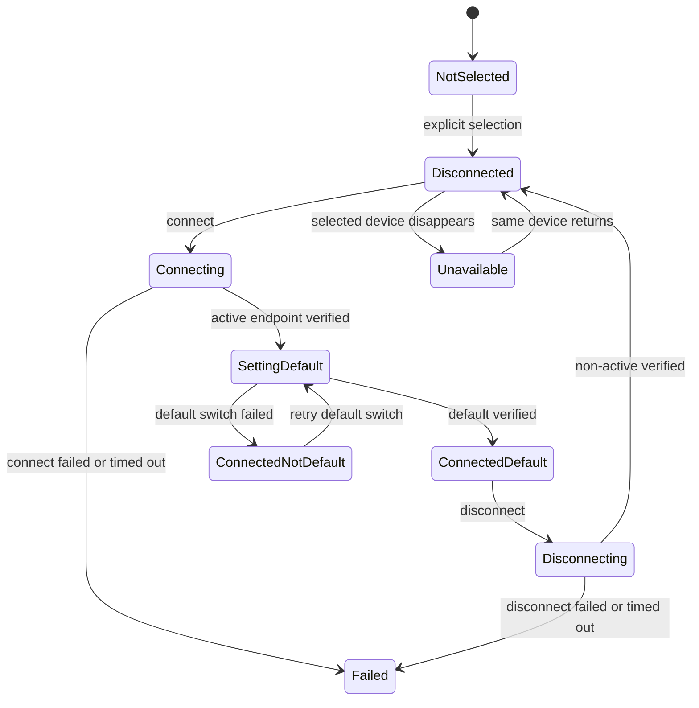

# QuickPods Bluetoothオーディオ選択・接続機能仕様

## 1. 目的と適用範囲

QuickPodsは、Windowsでペアリング済みのBluetoothオーディオ機器を一覧表示し、利用者が明示的に1台を選択して接続または切断できるようにする。接続完了後は、その機器の再生エンドポイントをWindowsの既定出力へ設定する。対象はヘッドホン、ヘッドセット、イヤホン、スピーカー等であり、AirPodsは互換性を確認する参照機器の1つとして扱う。

本機能は新規ペアリング、ペアリング解除、Bluetooth無線全体のON/OFFを行わない。

## 2. 用語と不変条件

| 用語 | 意味 |
|---|---|
| ペアリング済み | Windowsにデバイス関係が登録されている状態。音声接続済みとは限らない |
| 選択中 | QuickPodsの次回接続・切断対象として利用者が指定した1台 |
| 接続済み | 対象Containerに属する再生エンドポイントの実状態がActiveであることを確認済み |
| 既定出力 | Core Audioの`eRender/eConsole`等でWindowsが現在選択している音量操作対象 |
| 完全接続 | 接続済みを確認し、対象の再生エンドポイントが既定出力になったことも確認済み |
| 直接操作対応 | 対象機器でReconnectとDisconnectのKS Basic Supportを確認できた状態 |

次を不変条件とする。

1. 選択変更だけでは、どの機器にも接続、切断、既定出力変更を送信しない。
2. 更新だけでは、どの機器にも変更要求を送信しない。
3. 接続・切断要求は、選択時のContainer IDに属する検証済みKSフィルターだけへ送信する。
4. 選択状態、接続状態、既定出力状態を別々に保持する。
5. KS要求成功を接続成功として表示せず、MMDevice実状態と既定出力を順に確認する。
6. 1台の探索失敗や非対応を、無関係な機器の操作可否へ波及させない。
7. 接続または既定出力変更に失敗しても、直前の既定出力を無関係な機器へ変更しない。

## 3. デバイスカタログ

### 3.1 列挙と集約

- ペアリング済みBluetoothオーディオ候補を列挙し、`PKEY_Device_ContainerId`を軸に物理機器単位へ集約する。
- A2DP、HFP、Hands-Free、無効・未接続エンドポイントが複数存在しても、一覧は1 Containerにつき1行とする。
- オーディオ以外のBluetooth機器は一覧へ含めない。
- 同名機器を許容し、内部識別には表示名を使わない。
- 表示順は選択中、接続済み、表示名の順を基本とし、同順位では安定した内部順を用いる。

### 3.2 表示情報

各行は表示名、一般化した機器種別アイコン、`ペアリング済み`、接続状態、既定出力状態を持つ。状態は`接続済み・既定`、`接続済み`、`未接続`、`接続中`、`既定の出力へ切替中`、`切断中`、`利用不可`、`状態不明`、`直接操作は未対応`に正規化する。

生のContainer ID、MACアドレス、PnP ID、エンドポイントIDはUIや通常ログへ表示しない。診断ではサニタイズ済みキーを使用する。

## 4. 選択と永続化

- 一覧は単一選択とし、マウス、タッチ、矢印キー、Space/Enterで選択できる。
- 選択後に内部のContainer ID-backed keyをユーザー設定へ保存する。
- 再起動後に同じContainerが存在すれば再選択するが、自動接続や既定出力変更は行わない。
- 選択機器が消失した場合は`利用不可`として再列挙を待つ。再ペアリングでIDが変わった場合は再選択を案内する。
- 保存済み選択がなく候補が1台だけでも、製品初期仕様では利用者の明示選択を要求する。

## 5. 接続・切断・既定出力アクション

| 条件 | アクション |
|---|---|
| 未選択 | ボタン無効、一覧選択を案内 |
| 選択機器が未接続かつReconnect対応 | `接続` |
| 選択機器が完全接続済みかつDisconnect対応 | `切断` |
| 接続済みだが既定出力でない | `既定の出力に設定`または自動切替の再試行 |
| 操作中・状態不明・列挙中 | ボタン無効 |
| 直接操作非対応 | Windows Bluetooth設定を開く |
| 既定出力変更非対応 | Windowsサウンド設定を開く |

接続フローは次のとおりとする。

1. 選択キー、カタログ世代、直前の既定出力IDを取得する。
2. 選択Containerの再生エンドポイントとKSフィルターの所有関係を再検証する。
3. 未接続ならReconnectを1回送信し、対象再生エンドポイントがActiveになるまで最大15秒観測する。
4. Activeになった対象Containerの再生エンドポイントを一意に決定する。初期版では高品質なステレオ/A2DP側を優先し、通話用途のHands-Free側を既定出力にしない。
5. ConsoleとMultimediaの既定レンダーエンドポイントを対象IDへ設定する。Communicationsロールは初期値では変更せず、将来設定候補とする。
6. `OnDefaultDeviceChanged`と`GetDefaultAudioEndpoint`で対象IDへの変更を確認する。
7. 接続済みと既定出力の両方が確認できたときだけ、一連の操作を完全成功として表示する。

Microsoftの公開Core Audio APIは既定エンドポイントの取得と変更通知を提供する一方、一般デスクトップアプリ向けの既定エンドポイント設定APIを公開文書化していない。第一候補は非公開COM境界`IPolicyConfig::SetDefaultEndpoint`とし、COM宣言、CLSIDs、HRESULT変換を隔離したWindows統合アダプターだけに置く。独立Gateで対象Windowsビルドを検証し、利用できない場合は接続状態を正直に表示したまま`ms-settings:sound`へ案内する。

操作開始後に選択またはカタログ世代が変わった場合、古い結果は現在の選択行へ反映しない。ただし送信済みのOS要求は取り消せると仮定せず、元の対象の観測を完了してカタログを再同期する。初期版は全Bluetooth操作と既定出力変更をグローバルに直列化する。

切断時は対象ContainerのDisconnectだけを送信し、非Activeを確認する。Windowsが別の既定出力を自動選択したことを追跡するが、QuickPodsが過去の既定出力へ強制復元することは初期仕様に含めない。

## 6. 更新と通知

- ヘッダーの更新は読み取り専用の再列挙であり、進行中の観測世代を更新する。
- Windowsのデバイス通知を受けた場合は短いデバウンス後に差分更新する。
- 更新中も直前の一覧を保持し、行を不必要に消して点滅させない。
- Container ID-backed keyで差分を適用し、キーボードフォーカスと選択を可能な限り維持する。
- 無関係なエンドポイントの`IDeviceTopology`未対応等は、そのエンドポイントだけの診断として記録し、選択機器の完全な探索を妨げない。

## 7. 音量との関係

音量スライダーとミュートは常にWindowsの現在の既定再生エンドポイントを操作する。Bluetooth機器の選択だけでは音量対象を変更しない。接続フローが完全成功した後は、選択Bluetooth機器が既定出力になり、既存のCore Audio通知経由でスライダーも同機器へ追従する。

## 8. 状態モデルとデータ契約

```csharp
public sealed record BluetoothAudioDeviceDescriptor(
    string DeviceKey,
    string DisplayName,
    BluetoothAudioKind Kind,
    BluetoothConnectionState ConnectionState,
    DefaultOutputState DefaultOutputState,
    BluetoothControlCapability Capability,
    bool IsSelected);

public sealed record BluetoothAudioCatalogSnapshot(
    long InventoryGeneration,
    string? SelectedDeviceKey,
    IReadOnlyList<BluetoothAudioDeviceDescriptor> Devices,
    BluetoothOperationState Operation);
```

`DeviceKey`はContainer IDを直接UIへ公開しない内部不透明キーである。TaskbarHostへは選択機器の表示名、正規化状態、能力、操作中フラグだけを送り、カタログ全体や生IDは送らない。



## 9. 能力判定とGate

Gate AはBluetooth接続方式の成立性と機器ごとの能力判定を確立する。

- `DirectControlSupported`: Reconnect/Disconnectの両方向を安全に使用できる。
- `DirectControlUnsupported`: Basic Supportなし、`IKsControl`なし、または安全性要件を満たさない。
- `Unknown`: 探索不完全、機器利用不可、または一時エラー。

片方向だけ対応する場合は直接操作非対応とする。非対応機器が一覧に存在しても、対応機器の操作は継続できる。

Gate A2は既定出力変更方式を対象Windowsビルドで検証する。Console/Multimediaの変更、通知追従、再起動なし、通常権限、失敗時に元またはWindows選択状態を破壊しないことを満たす必要がある。Gate A2がNo-GoでもBluetooth接続機能は残し、サウンド設定への明示的フォールバックを表示する。

## 10. アクセシビリティ

- 一覧を名前付き単一選択グループとして公開し、各行に名前、選択、接続、既定出力、能力を付与する。
- 更新、接続、切断、既定出力再試行、ミュートにAutomationProperties.Nameを設定する。
- 色だけで状態を示さず、テキスト、アイコン形状、アクセシブル名を併用する。
- 200% DPIと高コントラストでも選択枠、フォーカス枠、状態テキストを識別可能にする。

## 11. 必須試験

1. 0件、1件、複数件、同名2件のカタログ表示。
2. A2DP/HFP等が1つの物理機器行へ集約されること。
3. 選択変更と更新で変更要求が0件であること。
4. 選択したContainer以外へKS要求や既定出力指定を送らないこと。
5. 非対応機器が対応機器の操作を妨げないこと。
6. 操作中の選択変更、再列挙、デバイス消失で古い結果を誤適用しないこと。
7. 接続確認後にConsole/Multimediaが対象ステレオ再生エンドポイントへ変わること。
8. 既定出力変更失敗を接続失敗と混同せず、部分状態と回復導線を表示すること。
9. 再起動後の選択復元と、再ペアリング後の安全な再選択案内。
10. キーボード、スクリーンリーダー、高コントラスト、200% DPI。
11. 参照実機では接続・切断各10回、他のBluetooth機器への影響0件。
