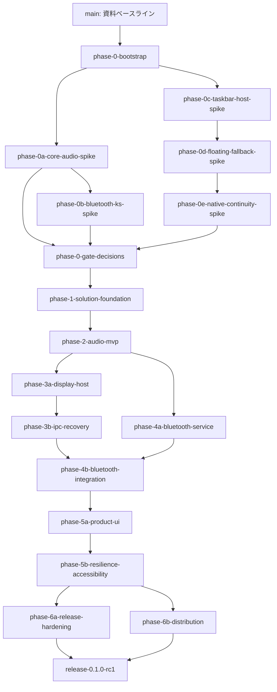

# QuickPods ブランチ別実装ロードマップ

## 文書情報

| 項目 | 内容 |
|---|---|
| 文書種別 | 実行計画・ブランチ戦略・品質ゲート |
| 対象 | QuickPods 初期リリース `0.1.0` |
| 作成日 | 2026-08-05 |
| 対象環境 | Windows 11 x64 / .NET 10 / WPF + Win32 |
| 基本文書 | `QuickPods_実装計画書.md` |
| ステータス | Phase 0 Spike実装・実機Gate待ち |

## 1. 目的

本書は基本計画を、レビュー可能なGitブランチ、具体的成果物、テスト、Go／No-Go条件へ落とし込む。各ブランチは一つの検証目的または製品価値に限定し、`main`を常にビルド・テスト可能な状態に保つ。

実装開始後は本書を進捗台帳として利用し、各ブランチの状態を`未着手`、`進行中`、`Gate待ち`、`完了`、`縮退`のいずれかへ更新する。

## 2. 現在の開始条件

2026-08-05時点のリポジトリ状態は次のとおりである。

| 項目 | 状態 |
|---|---|
| Git | `main`は`5d441e3`まで統合済み。現在はPhase 0Dからstackした`codex/phase-0e-native-continuity-spike` |
| Remote | `origin/main`作成済み。Phase 0 Spikeは短命ブランチとDraft PRで管理 |
| 追跡対象 | 計画資料、ブランド資産、solution基盤、Spike、検証証跡 |
| ソース／テスト／CI | .NET 10 solution、Windows CI、Smoke testを作成済み |
| AGENTS.md | なし |
| .NET SDK | `10.0.302`利用可能 |
| Windows Desktop Runtime | `10.0.10`利用可能 |
| Git LFS | 現在の最大ファイルが約1.2MBのため不要 |

資料ベースラインの初回コミットとB1 bootstrapは完了している。以後は`codex/`接頭辞の短命ブランチで作業する。

推奨初回コミット：

```text
docs: add QuickPods planning and branding assets
```

この初回コミットは本書を含む`docs/`だけを対象とする。実装コード、CI、ビルド設定は次のブートストラップブランチへ分離する。

## 3. ブランチ運用方針

1. 長期の`develop`ブランチは作らず、`main`と短命ブランチで運用する。
2. 各ブランチは最新の`main`から作成する。
3. 一つのブランチには一つの検証目的または利用者価値だけを含める。
4. `main`への統合は原則Squash Mergeとし、統合後に作業ブランチを削除する。
5. Spikeコードをそのまま製品層へ昇格させない。Spikeで確定した仕様を基に製品コードを実装し直す。
6. PR本文には対象の`FR-*`、`NFR-*`、`AC-*`、実行したテスト、実機条件、既知の制限を記載する。
7. ハードウェア依存試験ではWindowsビルド、Bluetoothアダプター、ドライバー版、対象機器、コミットSHAを記録する。
8. Endpoint ID、PnP ID、Container ID、MACアドレス等はそのまま保存せず、ハッシュまたは末尾だけを記録する。
9. Gate AまたはGate BがNo-Goでも、縮退仕様と決定記録を`main`へ統合して開発を継続する。
10. Core Audioが成立しない場合だけはアプリの中核要件を満たせないため、原因解消まで製品実装へ進まない。

推奨コミット形式はConventional Commitsとする。

```text
feat(audio): add endpoint volume monitoring
feat(taskbar): add safe-region discovery
fix(bluetooth): reject stale connection result
test(core): cover volume clamping
docs(adr): record taskbar host go decision
build: pin .NET SDK 10.0.302
ci: add Windows build and test workflow
```

## 4. 全体の依存関係



Phase 0ではCore AudioとタスクバーSpikeを並行開始できる。Bluetooth Spikeは、Core Audio Spikeで確認したMMDevice列挙・状態監視の知見を利用するため、その結果を受けて実行する。Phase 3aとPhase 4aはPhase 2後に並行実装できるが、一人で進める場合は表の番号順を標準とする。

## 5. フェーズとブランチ

### Phase 0：リポジトリ基盤と技術成立性

#### B0：資料ベースライン

| 項目 | 内容 |
|---|---|
| 反映先 | `main`へ初回コミット |
| 目的 | すべてのブランチの共通基点を作る |
| 内容 | 計画書、ロードマップ、UIモック、ブランド資産 |
| 検証 | ファイル一覧、画像表示、秘密情報・一時ファイルがないこと |
| 完了条件 | `main`に初回コミットが存在し、作業ツリーがクリーン |

この作業だけはPRを作成する基点が存在しないため、`main`へ直接行う。

#### B1：`codex/phase-0-bootstrap`

| 項目 | 内容 |
|---|---|
| 目的 | Spikeを独立して追加できる最小開発基盤を作る |
| 状態 | **完了** — `main`の`5d441e3`、PR #3 |
| 主な成果物 | `.gitignore`、`.gitattributes`、`.editorconfig`、`global.json`、`Directory.Build.props`、`Directory.Packages.props`、`QuickPods.sln`、`spikes/`、最小テスト構成、Windows CI |
| 設定 | .NET SDK `10.0.302`系列、`net10.0-windows`、x64、nullable、analyzers、warnings as errors |
| CI | restore、Release build、test、format検証 |
| 禁止事項 | WPF製品UI、Bluetooth本実装、タスクバー本実装を含めない |
| 完了条件 | クリーン環境で`dotnet restore`、`dotnet build -c Release`、`dotnet test -c Release`が成功 |

`global.json`は`10.0.302`を基準とし、同じ10.0 feature band内の安全なパッチ更新を許可する。WPFに追加の.NET workloadは不要である。

#### B2：`codex/phase-0a-core-audio-spike`

| 項目 | 内容 |
|---|---|
| 目的 | 公開Core Audio APIによる中核機能の成立性とCOMスレッドモデルを確定する |
| 状態 | **Gate待ち** — Issue #4、Draft PR #7。実機試験未完了 |
| Spike | `spikes/QuickPods.Spike.CoreAudio/` |
| 実装 | 既定Endpoint取得、音量・ミュート取得／変更、変更通知、既定デバイス変更、再バインド |
| 自動試験 | Scalar変換、クランプ、自通知GUID、コールバックキュー、世代破棄 |
| 実機試験 | 0／50／100%、外部UI変更、音量キー、デバイス切替、1,000回変更 |
| 完了成果物 | Spikeコード、`decision.md`、環境、テスト結果、計測CSV、サニタイズ済みログ |

Go条件：

- Windows標準UIとの差が±1%以内である。
- 操作反映開始のp95が100ms以内である。
- 外部変更反映のp95が250ms以内である。
- 1,000回変更でクラッシュせず、Private Bytes、Handle、Thread、COM再バインド回数が継続的に単調増加しない。
- 既定デバイス変更後に再起動なしで追従する。

1,000回試験では再生を停止し、安全な範囲の小幅変更を用い、`finally`で元の音量とミュート状態を復元する。

No-Go時：原因を分類し、解消するまでPhase 1以降へ進まない。

#### B3：`codex/phase-0b-bluetooth-ks-spike`

| 項目 | 内容 |
|---|---|
| 目的 | MediaTekドライバーとAirPods Proで個別接続・切断が成立するか確定する |
| 状態 | **Gate待ち** — Issue #5、Draft PR #8。実機試験未完了 |
| Spike | `spikes/QuickPods.Spike.BluetoothKs/` |
| 実装 | Container ID探索、DeviceTopology、KS Filter対応付け、Basic Support、Reconnect／Disconnect、MMDevice実状態確認 |
| 実機試験 | 接続10回、切断10回、圏外、ケース内、他端末接続、Bluetooth無線OFF、他機器影響 |
| 完了成果物 | Spikeコード、フィルター選択手順、状態遷移ログ、Gate A判断 |

各操作では次を別々に記録する。

- KS要求時刻、HRESULT、Basic Support結果
- MMDevice通知時刻
- 250msポーリングで確認した最終状態
- 状態確定までの時間
- タイムアウト理由
- 操作前後のキーボード、DualSense等の接続状態

Go条件：

- 管理者権限なしで接続・切断の両方向が動作する。
- 機器が到達可能等の事前条件成立時に、接続・切断がそれぞれ10回中9回以上、15秒以内に実状態で確認できる。
- KS要求成功を実接続成功と誤表示した件数が0である。
- 他のBluetooth機器への影響が0件である。

片方向だけ成功する場合はConditional Goにせず、直接操作はNo-Goとする。

No-Go時：Bluetoothボタンは`ms-settings:bluetooth`等のWindows設定ランチャーへ縮退し、音量と表示機能の開発を継続する。

#### B4：`codex/phase-0c-taskbar-host-spike`

| 項目 | 内容 |
|---|---|
| 目的 | `SetParent`とUI Automationを使ったネイティブ表示のGate Bを判定する |
| 状態 | **Gate待ち** — Phase 0Cの診断、Phase 0Dのfallback、Phase 0Eのnative continuity、Popup方式選定、採用PopupのExplorer再起動10回まで完了。残るstress matrixを継続 |
| Spike | `spikes/QuickPods.Spike.TaskbarHost/` |
| 実装 | ランドマーク探索、安全領域可視化、raw HWND、透過double-buffer描画、入力、`WS_POPUP`／`WS_CHILD`比較、UIA即時監視、hide-first復旧、stable Watchdog表示継続 |
| 実機試験 | DPI 100／125／150／200%、Start中央／左寄せ、Widgets ON／OFF、検索4形式、空き不足、Explorer再起動10回 |
| 完了成果物 | Spikeコード、配置スクリーンショット、計測結果、採用スタイル、Gate B判断 |

安全な評価順序は次のとおりとする。

```text
ホストを隠す
  → UI Automation列挙
  → 物理ピクセルへ正規化
  → 障害物区間を差し引く
  → Place／VerifiedNoFit／TransientUnknownを判定
  → Placeの場合だけSetParentして表示
```

初回表示と安全性を確認できない復旧はこのhide-first順序を守る。5秒Watchdogのfresh scanで同一identity、native attachment有効、現在矩形safeを確認できる場合だけ、不要な表示遷移を行わず可視状態を維持する。

Go条件：

- Windows標準要素との交差面積が0pxである。
- `TransientUnknown`では推測配置せず非表示になる。
- DPI 100／125／150／200%で描画位置と入力位置が一致する。
- Explorer再起動10回すべてで10秒以内に復旧し、重複HWNDが0件である。
- WPF本体のDPI Awarenessに変化がない。

No-Go時：フローティングを標準表示、通知領域を最終退避先とし、ネイティブホストは製品コードへ含めない。

#### B4.1：`codex/phase-0d-floating-fallback-spike`

| 項目 | 内容 |
|---|---|
| 基点 | `codex/phase-0c-taskbar-host-spike`からstack。Phase 0Cの安全性を変更せず、復帰UXだけを検証する |
| 目的 | Start／Search中の`PrimaryTaskbarMissing`、`VerifiedNoFit`、native作成失敗時もプロセスと操作面を維持する |
| 状態 | **完了** — 自動試験、175%のfallback／promotion、100／200%左揃えNoFitのfloating目視・入力・自然破棄・残留0に合格。Start／Searchの最終UXはPhase 0Eのnative continuityで検証 |
| フォールバック | 直前の完全検証済みprimary work-area／DPIがある場合だけ、unowned・non-topmost floatingへ即時退避。安全なgeometryがなければ非表示 |
| geometry失効 | Start／Searchの一時的なprimary欠落では保持し、Settings／Display／DPI変更時だけ破棄 |
| native復帰 | 1秒cooldown、500ms以上離れた同一candidate 2回、fresh watcher fenceを満たした後、hidden-prepared nativeへ二段階で昇格 |
| セッション保護 | native作成失敗3回でセッション中のnativeをlatch無効化。`--duration`はsurface遷移でresetしない |
| CLI | `host --style child|popup --fallback floating|hidden --duration ... --confirm-live-host`（既定は`floating`） |
| 自動検証 | TaskbarHost 301件＋Smoke 1件、Release build 0 warning／0 error、format／diff check合格 |
| 実機自動検証 | DPI 168（175%）、45秒EXE、Start 12秒／Search 12秒入力、exit 0、残留0。少なくとも1回`External / StructureChanged`から`NativeVisible → FloatingFallback → NativePromoted`を確認 |
| 実機手動検証 | 100／200%左揃えNoFitでunowned・non-topmost floating、click／drag／wheel、自然破棄、残留0に合格。Issue #11完了条件を満たした |
| 後続 | 100% icon＋labelのStart／Search個別試験とnative style選定はPhase 0Eで完了。NoFit等の真のunsafe状態では本fallbackを維持 |

実機ホスト検証はapplication manifestが適用されるEXEまたは`dotnet run`で行う。DLLの直接起動はmanifestが適用されないため、DPI／hostの実機証跡として使用しない。Gate Bは上記の手動項目が完了するまでPendingとする。

#### B4.2：`codex/phase-0e-native-continuity-spike`

| 項目 | 内容 |
|---|---|
| 基点 | `codex/phase-0d-floating-fallback-spike`からstack。unsafe時のfallbackを残したまま、同一generationを直接再証明できる一時状態だけnativeを保持 |
| 目的 | Start／Search表示中も、Windows標準要素と重ならず、同じタスクバー位置で表示とwheel入力を継続する |
| 継続anchor | 通常の完全観測で得たprimary taskbar identity／geometryと一意なStartだけが起点。初回配置や別taskbar探索には使用しない |
| Direct証明 | top-level列挙成功、競合taskbar 0、exact retained taskbarのclass／root／process／bounds／DPI／monitor／work area／visibility／DWM一致 |
| 限定保持 | Direct routeの単独`StartButtonMissing`だけ最後の完全Startを保持。fresh UIA buttons、fresh native obstacles、直前完全obstaclesをunionし、現在boundsの交差0pxを再検証 |
| host証明 | exact child一致、またはQuickPods class／same process／GA_PARENT／bounds／DPI／visibility／DWMのdirect attachment証明。runtimeでもstyleを含め再検証 |
| timeout／監視 | UIA前後のnative再探索、watcher generation fence、固定500ms deadline、Direct中500ms rescan、100ms surface health check |
| style判断 | `PopupPreserved`を採用。`SetParent`後も`WS_POPUP`を維持し、Childは明示比較／rollback用に残す。CLI既定はPopup |
| 自動検証 | TaskbarHost 183件＋Smoke 1件。重複整理前368件から50.0%へ縮約し、Release build 0 warning／0 error、format／diff check合格 |
| 実機検証 | 100%・1920×1080と150%・5120px幅タスクバーの各120秒Popup EXE。Start／Search双方でnative保持、Floating遷移0、表示中wheel入力、自然破棄、残留0。ユーザー目視・入力確認合格 |
| 多数ピン留め | 150%でbutton 27→52、Start X 1919→1094でも`Place / Standard`。自動監査と75秒手動runで重なり／ちらつきなし、wheel 18件、drag 18組、Floating／fatal／残留0 |
| Explorer復旧 | 採用Popupで10/10回が10秒以内（最大5.395秒）。旧View消失、新Explorer世代、View／Control各1、Popup style／実親／DWM、exit 0、終了後残留0を確認 |
| 既知P2 | UIA event watcher再購読でUSER objectがExplorer世代ごとに1増加（10回で22→32）。GDI／HWND inventoryは不変。製品化前の隔離方式をIssue #18で追跡し、Phase 0Eの単体テストは再拡張しない |
| 残件 | tray churn中Start保持。完了までGate BはPending |

Start／Search表示中でも、identity、parent、style、bounds、DPI、monitor、DWM、fresh obstacle、watcher generationのいずれかが変化した場合はnativeを保持せず、Phase 0Dのfloating／hidden fallbackへ即時退避する。保持結果を新しいbaselineにはせず、freshでfault 0のUIA成功時だけStart anchorを更新する。

#### B5：`codex/phase-0-gate-decisions`

| 項目 | 内容 |
|---|---|
| 目的 | 3件のSpike結果を製品仕様へ反映する |
| 成果物 | Gate A／B、Core Audio判定、ADR、縮退仕様、未解決リスク、更新済みロードマップ |
| コード | 原則なし。必要なら機能フラグとCapabilityモデルの契約案だけを記載 |
| 完了条件 | Phase 1で実装する構成が一意に決まり、未検証の前提が必須要件として残っていない |

検証記録は次の構成へ保存する。

```text
docs/validation/phase-0/
├─ core-audio/
│  ├─ decision.md
│  ├─ environment.md
│  ├─ test-results.md
│  ├─ metrics.csv
│  ├─ logs/
│  └─ screenshots/
├─ bluetooth-ks/
└─ taskbar-host/
```

### Phase 1：製品ソリューション基盤

#### B6：`codex/phase-1-solution-foundation`

| 項目 | 内容 |
|---|---|
| 目的 | OS依存実装を差し替え可能な製品構造を作る |
| プロジェクト | `QuickPods.App`、`QuickPods.Core`、`QuickPods.Windows`、`QuickPods.TaskbarHost`、`QuickPods.Contracts`、`QuickPods.Infrastructure`、対応テスト |
| Core | 状態モデル、`StateCoordinator`骨格、エラー分類、Capability、設定モデル |
| Contracts | IPC DTO、`ProtocolVersion = 1`、Sequence、Interaction契約 |
| Infrastructure | 構造化ログ、設定保存、単一インスタンス、ホスト起動監視の骨格 |
| CI | NuGet locked restore、format、Release/x64 build、unit test、TRX／coverage保存 |
| 完了条件 | 警告0、CI成功、OS依存サービスをテストダブルへ交換可能、Gate A／Bの縮退状態を表現可能 |

このブランチではUIの完成やWindows APIの本実装を行わない。

### Phase 2：音量MVP

#### B7：`codex/phase-2-audio-mvp`

| 項目 | 内容 |
|---|---|
| 目的 | 最初に日常利用できる音量・ミュート機能を完成させる |
| Windows層 | MTA Core Audioワーカー、`IMMNotificationClient`、`IAudioEndpointVolumeCallback`、再バインド |
| Core層 | 音量状態、世代管理、自通知抑止、最新値優先の30～60Hz間引き |
| UI | 診断用WPF画面、音量スライダー、ミュート、既定デバイス名 |
| テスト | Scalar変換、クランプ、ミュート、世代破棄、高速ドラッグ、デバイス無効化／切替 |
| 完了条件 | AC-001～AC-006を満たし、100回高速ドラッグと既定デバイス切替から自動復旧 |

完了後に`0.1.0-alpha.1`相当の内部成果物を作成できる。

### Phase 3：表示ホストとIPC

#### B8：`codex/phase-3a-display-host`

| 項目 | 内容 |
|---|---|
| 目的 | 業務サービスから独立した表示ホストを完成させる |
| Gate BがGo | raw Win32 `QuickPods.TaskbarHost`、UIA探索、安全領域、描画、ヒットテスト |
| Gate BがNo-Go | タスクバー直上のフローティングストリップを実装 |
| 共通 | `Place`／`VerifiedNoFit`／`TransientUnknown`、DPI座標、負座標、テーマ入力 |
| テスト | 障害物区間、最大空き、境界値、擬似親ウィンドウ、DPI変更、マウスキャプチャ |
| 完了条件 | 不明時に推測配置せず、表示可能時だけ静的スナップショットを安全に描画・操作可能 |

#### B9：`codex/phase-3b-ipc-recovery`

| 項目 | 内容 |
|---|---|
| 目的 | 本体、Core Audio、表示ホストを結合し、表示の復旧とフォールバックを完成させる |
| IPC | 同一ユーザーSID限定の名前付きパイプ、ProtocolVersion、Sequence、再接続時の完全スナップショット |
| 入力 | 音量暫定値／最終値、ミュート、フライアウト要求、コンテキストメニュー要求 |
| 復旧 | `TaskbarCreated`、Watchdog、Explorer世代、ホスト再起動、連続失敗時のセッション無効化 |
| フォールバック | ネイティブ、フローティング、通知領域の切替と点滅防止 |
| テスト | IPC順序逆転、切断再接続、Explorer再起動10回、空き消失、ホスト異常終了 |
| 完了条件 | AC-014～AC-021のうちBluetooth非依存項目を満たし、音量を選択された表示モードから操作可能 |

### Phase 4：Bluetoothサービスと統合

#### B10：`codex/phase-4a-bluetooth-service`

| 項目 | 内容 |
|---|---|
| 目的 | Bluetooth機器管理をUIと表示ホストから独立して完成させる |
| Gate AがGo | 機器列挙、Container IDグルーピング、DeviceTopology／IKsControl、状態機械、15秒タイムアウト |
| Gate AがNo-Go | `BluetoothDriverUnsupported`を返すCapabilityサービスとWindows設定ランチャー |
| テスト | 状態遷移、キャンセル、古い世代結果、二重要求、同名機器、タイムアウト、未対応経路 |
| 完了条件 | 対応／未対応の双方でサービス層の結果が一意で、失敗を成功として返さない |

#### B11：`codex/phase-4b-bluetooth-integration`

| 項目 | 内容 |
|---|---|
| 目的 | Bluetooth状態と操作を本体、診断UI、表示ホストへ統合する |
| 実装 | 対象機器選択、接続状態表示、接続／切断、連打防止、設定導線、StateSnapshot反映 |
| 実機試験 | AirPods接続／切断、圏外、ケース内、他端末、無線OFF、再ペアリング、他機器影響 |
| 完了条件 | AC-007～AC-013を満たし、未対応環境でもアプリが停止しない |

完了後にGate Cを判定し、`0.1.0-beta.1`相当の内部成果物を作成する。

### Phase 5：製品UI、常駐、復旧、アクセシビリティ

#### B12：`codex/phase-5a-product-ui`

| 項目 | 内容 |
|---|---|
| 目的 | モックアップに沿った日常利用可能な製品シェルを完成させる |
| UI | WPFフライアウト、設定画面、通知領域メニュー、ツールチップ、エラーと再試行 |
| 設定 | 表示モード、対象機器、ホイール刻み、テーマ、切断確認、自動起動 |
| 常駐 | 単一インスタンス、トレイ常駐、Windowsログイン時のユーザー単位自動起動 |
| 導線 | Windowsサウンド設定、Bluetooth設定、ログ表示／コピー |
| ブランド | 承認済みQuickPodsアイコン、製品名、バージョン情報 |
| テスト | ViewModel、設定永続化、自動起動ON／OFF、二重登録防止、Tray終了／再試行 |
| 完了条件 | FR-UI-001～007を満たし、再起動後も設定が保持される |

自動起動の初期値はOFFとし、本体`QuickPods.exe`だけをユーザー単位で登録する。`QuickPods.TaskbarHost.exe`は本体が起動・監視する。

#### B13：`codex/phase-5b-resilience-accessibility`

| 項目 | 内容 |
|---|---|
| 目的 | OSライフサイクルとアクセシビリティを完成させる |
| 復旧 | スリープ／休止、RDP、表示変更、テーマ、高コントラスト、モニター抜き差し |
| A11y | AutomationProperties、Tab、矢印、Space、Enter、Esc、色以外の状態表現 |
| 信頼性 | 設定破損隔離、段階的再試行、ホスト連続失敗制限、例外境界 |
| テスト | 200%以上のDPI、高コントラスト、スリープ復帰、RDP接続解除、混在DPI |
| 完了条件 | FR-UI-008、主要NFR、AC-022～026を満たし、サービス例外でアプリ全体が終了しない |

### Phase 6：Release Candidateと配布

#### B14：`codex/phase-6a-release-hardening`

| 項目 | 内容 |
|---|---|
| 目的 | Release Candidateの機能・性能・リソース品質を確定する |
| 自動試験 | 単体、Windows統合、擬似親、IPC、設定移行、回帰試験 |
| 実機試験 | 全手動マトリクス、Explorer再起動反復、Bluetooth 100サイクル、24時間試験 |
| 計測 | CPU、Working Set、GDI、USER、Handle、COM、IPC再接続、UIA時間 |
| 文書 | 互換性、既知の制限、試験記録、残存リスク |
| 完了条件 | AC-001～027、Gate Dの品質項目を満たし、継続的なリソース増加がない |

#### B15：`codex/phase-6b-distribution`

| 項目 | 内容 |
|---|---|
| 目的 | 再現可能で導入・削除できる配布物を作る |
| 発行 | `win-x64` self-contained、Release、再現可能ビルド、SHA-256 |
| 配布 | 決定したインストーラー形式、ポータブル診断版、更新方針 |
| ブランド | ICO、実行ファイル情報、バージョン、アンインストール表示 |
| 法務 | `ThirdPartyNotices`、Ceiling由来箇所がある場合のMIT全文 |
| テスト | クリーン環境でインストール、起動、更新、アンインストール、自動起動残骸確認 |
| 完了条件 | 管理者権限なしで通常実行でき、配布物とチェックサムをCIから再生成可能 |

B15はB13後に準備を開始できるが、最終マージはB14のGate D通過後とする。

#### B16：`codex/release-0.1.0-rc1`

| 項目 | 内容 |
|---|---|
| 目的 | RC固有のバージョン、リリースノート、最終スモーク試験だけを行う |
| バージョン | `0.1.0-rc.1` |
| 完了条件 | RC配布物が再生成でき、重大な既知不具合がなく、最終承認後に`v0.1.0`タグを作成可能 |

## 6. 各PRの共通マージ条件

すべての実装PRは次を満たす。

- 最新`main`を基点としている。
- Releaseビルドと対象テストが成功する。
- コンパイラー警告とアナライザー警告が0件である。
- `dotnet format --verify-no-changes`が成功する。
- 公開契約、設定スキーマ、IPCを変更した場合は互換性テストと文書を更新する。
- OS API失敗を分類し、UIスレッドまたはWndProcで重い処理を行わない。
- デバイス識別子、MACアドレス、個人情報、秘密情報をログやテスト成果物へ残さない。
- 新しいロジックには相応の単体テストがある。
- Windows依存変更には対象PC上の検証結果がある。
- UI変更にはスクリーンショットとキーボード操作結果がある。
- PR本文に完了した要件IDと未達項目を明記する。

標準コマンド：

```powershell
dotnet restore
dotnet format --verify-no-changes
dotnet build QuickPods.sln -c Release --no-restore
dotnet test QuickPods.sln -c Release --no-build --logger trx
```

製品EXE作成後はCIへ次も追加する。

```powershell
dotnet publish src/QuickPods.App/QuickPods.App.csproj -c Release -r win-x64 --self-contained true
dotnet publish src/QuickPods.TaskbarHost/QuickPods.TaskbarHost.csproj -c Release -r win-x64 --self-contained true
```

ハードウェア依存試験は通常のGitHub-hosted runnerでは合格判定できないため、対象PCで手動実行し、`docs/validation/`へ結果を保存する。将来、専用self-hosted runnerを用意できた場合だけ自動化する。

## 7. CIジョブ構成

| ジョブ | 実行環境 | 開始時期 | 内容 |
|---|---|---|---|
| `format` | `windows-latest` | B1 | フォーマット検証 |
| `build-test` | `windows-latest` | B1 | locked restore、Release/x64 build、unit test、TRX、coverage |
| `windows-integration` | `windows-latest` | B2以降 | ハードウェア不要のWindows API統合試験 |
| `publish-smoke` | `windows-latest` | B7以降 | App／TaskbarHostのself-contained publish |
| `dependency-audit` | `windows-latest` | B6 | 直接・推移NuGet依存の脆弱性確認 |
| `release-package` | `windows-latest` | B15 | 配布物、チェックサム、Third-party Notices |

ハードウェア試験は`Hardware`、長時間試験は`Soak`等のカテゴリを付け、通常CIから除外する。

## 8. バージョニングとマイルストーン

| マイルストーン | バージョン | 条件 |
|---|---|---|
| Phase 0 | 製品バージョンなし | Gate判定のみ |
| Audio MVP | `0.1.0-alpha.1` | AC-001～006 |
| Integrated Beta | `0.1.0-beta.1` | Gate C、AC-001～021の該当構成 |
| Release Candidate | `0.1.0-rc.1` | Gate D候補 |
| Initial Release | `0.1.0` | 全DoDと配布試験 |

バージョンは`Directory.Build.props`で一元管理する。`InformationalVersion`にはコミットSHAを含め、正式版は`v0.1.0`形式のタグを付ける。

## 9. 実装開始時の手順

計画承認後は次の順で開始する。

1. `docs/`を精査し、v1／v2アイコン等の採否と保持方針を確定する。
2. `main`へ資料ベースラインの初回コミットを作成する。
3. `codex/phase-0-bootstrap`を作成する。
4. B1の最小ソリューション、品質設定、CIを実装する。
5. B1を検証して`main`へSquash Mergeする。
6. Core Audio SpikeとTaskbar Host Spikeを最新`main`から作成する。
7. Core Audioの結果を受けてBluetooth KS Spikeを開始する。
8. 3件のSpike完了後に`codex/phase-0-gate-decisions`で製品構成を確定する。

## 10. 計画変更ルール

- Gate結果による縮退は失敗ではなく、計画済みの製品構成変更として扱う。
- 新しい非公開API、Explorer注入、管理者権限、外部スクリプト依存を追加する場合は、実装前にADRとユーザー承認を必要とする。
- 初期スコープ外機能を追加する場合は、現在のブランチへ混ぜず次のマイルストーンへ送る。
- 一つのPRで複数フェーズの受入基準を同時に満たそうとせず、統合ブランチで明示的に結合する。
- Windows Updateで前提が変わった場合はGate Bを再実行し、互換性結果を新しいコミットSHAとOSビルドで記録する。

---

資料ベースラインは`main`の初回コミット`1f63aa1`、B1 bootstrapは`5d441e3`として統合済みである。Phase 0CはTaskbarHost 216件＋Smoke 1件、150%可視ChildのExplorer再生成10/10回、200% NoFit再検出10/10回までを履歴として確定し、Start／Search中の`PrimaryTaskbarMissing`ではnativeを安全にhideすることを確認した。Phase 0DはTaskbarHost 301件＋Smoke 1件、175%のStart／Search入力を含むEXEでfloating fallbackとnative promotionを確定し、Phase 0Eで100／200%左揃えNoFitのfloating目視・入力・自然破棄・残留0まで合格した。現在の`codex/phase-0e-native-continuity-spike`は重複整理後のTaskbarHost 183件＋Smoke 1件（整理前368件の50.0%）、Release build 0 warning／0 error、format／diff checkに合格し、100%・1920×1080と150%・5120px幅タスクバーの各120秒Popup EXEでStart／Search双方のnative保持、表示中wheel入力、Floating遷移0、自然破棄、残留0を確認した。150%の多数ピン留めstressもbutton 52、重なり／ちらつき／入力問題なし、Floating／fatal／残留0で合格した。`PopupPreserved`を採用方式に選定し、Childは比較／rollback用に残す。採用PopupのExplorer再起動も10/10回・最大5.395秒・重複／残留0で合格した。UIA watcherのExplorer世代別USER object増加はIssue #18で非ブロッキングP2として追跡し、tray churn中Start保持が未完了のためGate BはPendingである。B2／B3／B4.2の実機Gateが完了するまでB5およびPhase 1へ進めない。
