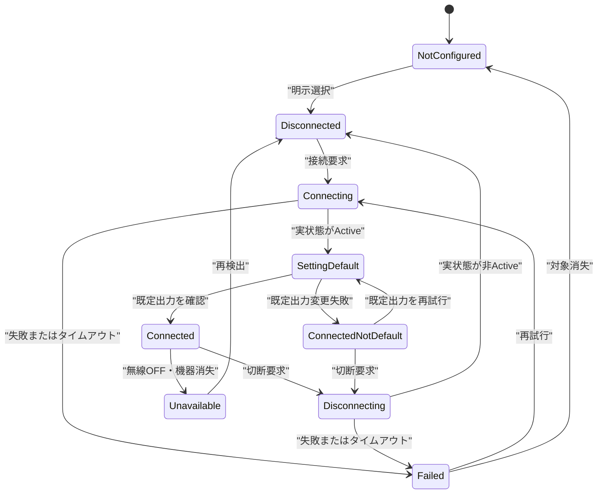
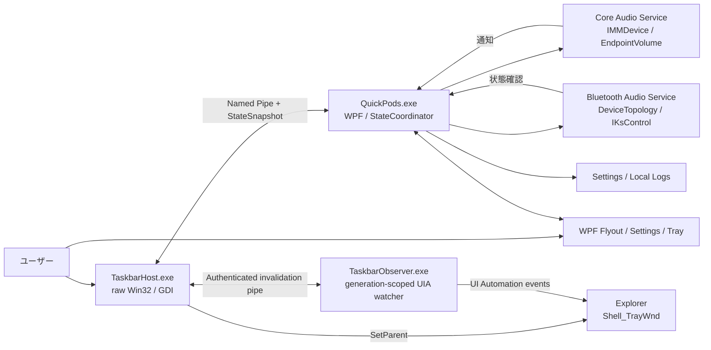

# QuickPods — Windows 11 タスクバー音量・Bluetoothオーディオ操作アプリ 計画書

## 文書情報

| 項目 | 内容 |
|---|---|
| 文書種別 | 技術調査・基本設計・実装計画書 |
| プロジェクト名 | QuickPods |
| 作成日 | 2026-08-05 |
| 対象OS | Windows 11 x64 |
| 実装言語 | C# |
| 製品ターゲット | .NET 10 / WPF + Win32 |
| ステータス | Phase 0完了・全Gate Go・Phase 1着手可 |
| 参考実装 | Ceiling（MIT License） |

> 本書は、これまで行った対象PCの確認、Windows公式APIの調査、CeilingのGitHubソース監査を統合した実装計画である。タスクバー内表示とBluetoothオーディオ機器の個別接続・切断は、いずれも環境依存性があるため、技術スパイクの合格を本実装着手のゲートとする。

## 目次

1. エグゼクティブサマリー
2. 背景・目的
3. スコープ
4. 対象環境の確認結果
5. 調査結果
6. 設計判断
7. UX・画面仕様
8. 機能要件
9. 非機能要件
10. 推奨アーキテクチャ
11. 詳細技術設計
12. エラー設計
13. 実装計画
14. テスト計画
15. 受入基準
16. リスク管理
17. 開発・品質ゲート
18. Definition of Done
19. 未決事項
20. 参考資料・ライセンス

## 1. エグゼクティブサマリー

本アプリは、Windows 11のタスクバー内にコンパクトな音量スライダーを常時表示し、現在の既定の再生デバイスに対して次の操作を即座に行えるようにする常駐デスクトップアプリである。

- マスター音量の表示・変更
- ミュート状態の表示・切り替え
- ペアリング済みBluetoothオーディオ機器の一覧、明示選択、接続・切断
- 接続確認後、その機器の再生エンドポイントをWindowsの既定出力へ設定
- 既定のオーディオデバイス変更への自動追従
- タスクバー内に配置できない場合の安全なフローティング表示

タスクバー内表示は、Ceilingと同様に独自のWin32ウィンドウをExplorerの`Shell_TrayWnd`へ`SetParent`し、WidgetsとStartの間に実在する空き領域へ配置する。この方式は見た目としてはタスクバーの一部になるが、Windowsが正式に提供するウィジェット登録APIではない。したがって、既存UIを押し退けたり覆ったりせず、安全な空きを確認できたときだけ使用する。

Bluetoothについては、Bluetooth無線全体をOFFにしない。対象PCにはキーボードやDualSenseなど他のBluetooth機器も存在するため、一覧で明示選択したBluetoothオーディオ機器の音声接続だけを操作する。Microsoftが公開している`KSPROPSETID_BtAudio`のワンショット接続・切断プロパティを候補とし、機器ごとの対応能力を判定する。接続を実状態で確認した後、その機器のステレオ再生エンドポイントをConsole／Multimediaの既定出力へ設定し、Core Audio通知で変更を確認する。AirPods Pro＋MediaTek環境は最初の参照実機であり、製品仕様をAirPodsへ限定しない。

## 2. 背景・目的

### 2.1 背景

Windows 11標準UIで音量を変更する場合、通知領域のクイック設定を開いてからスライダーを操作する必要がある。また、Bluetoothヘッドホンの再接続・切断にはクイック設定または設定画面を開く必要があり、頻繁な切り替えには手数が多い。

提供画像の環境は横幅が広く、左側のWidgets／天気領域と中央配置されたStart・アプリアイコン群の間に大きな未使用領域がある。この領域を、日常的なオーディオ操作のために活用する。

### 2.2 目的

1. 既定の再生デバイスの音量を、別画面を開かずにタスクバーから変更できるようにする。
2. ミュートとBluetoothオーディオ接続状態を一目で確認できるようにする。
3. 複数のペアリング済みBluetoothオーディオ機器から1台を選び、1クリックで接続・切断できるようにする。
4. 接続完了後、その機器をWindowsの既定の音声出力へ設定する。
5. Windows標準タスクバーのWidgets、Start、検索、アプリ、通知領域を妨げない。
6. Explorer再起動、既定デバイス変更、スリープ復帰後も自動復旧する。
7. 非対応環境ではアプリ全体を停止させず、安全な代替表示とWindows設定への導線を提供する。

### 2.3 成功の定義

初期リリースの成功は、対象PCで次をすべて満たすこととする。

- タスクバー内の音量スライダーをドラッグし、Windowsのマスター音量を連続変更できる。
- Windows側やキーボードから行った音量・ミュート変更が表示へ追従する。
- 選択したBluetoothオーディオ機器だけを接続・切断でき、他のBluetooth機器へ影響しない。
- 接続完了後、対象のステレオ再生エンドポイントが既定出力になったことを確認できる。
- 接続・切断要求の「送信成功」と実際の状態変化を区別できる。
- Widgets、Start、検索、アプリ、通知領域を覆わない。
- 安全な空きがない場合は、タスクバー直上または通知領域へ自動的に退避する。
- Explorer再起動後に二重表示せず復旧する。

## 3. スコープ

### 3.1 初期リリースの対象

- Windows 11 x64
- プライマリモニターのタスクバー
- 既定の再生エンドポイントのマスター音量とミュート
- ペアリング済みBluetoothオーディオ機器の一覧、単一選択、選択の永続化
- 選択した機器の接続・切断
- 接続確認後のConsole／Multimedia既定出力設定
- タスクバー内ネイティブ表示
- タスクバー直上のフローティングフォールバック
- 通知領域アイコン、設定画面、詳細フライアウト
- Explorer再起動・表示構成変更・スリープ復帰への追従
- ローカル設定と診断ログ

### 3.2 初期リリースの対象外

- Bluetooth機器の新規ペアリング／ペアリング解除
- Bluetooth無線全体のワンクリックON/OFF
- アプリ単位の音量ミキサー
- マイク入力音量
- イコライザーや音質処理
- Windows標準タスクバーボタンの移動・非表示・サイズ変更
- ExplorerへのDLL注入、サブクラス化、プロセスメモリ書き換え
- Windows 10、Windows Server、ARM64の正式サポート
- Microsoft Store公開の保証

### 3.3 将来候補

- セカンダリモニターを含む全タスクバー表示
- 音量ホットキー
- Communicationsロールの既定出力自動変更
- 接続前の既定出力を記憶した切断時の自動復元
- ARM64
- UI Automation Providerによるタスクバー内カスタムコントロールの完全なスクリーンリーダー対応
- 対応確認済みドライバー／機器の互換性データベース

## 4. 対象環境の確認結果

調査時点で確認した対象PCの構成は次のとおりである。

| 項目 | 確認結果 |
|---|---|
| OS | Windows 11、`10.0.26200` |
| アーキテクチャ | `win-x64` |
| インストール済み.NET SDK | `10.0.302`（ほかに6.0／8.0／9.0も導入済み） |
| Bluetoothアダプター | MediaTek Bluetooth Adapter |
| Bluetoothオーディオドライバー | MediaTek Bluetooth Audio Device |
| 参照Bluetoothオーディオ機器 | AirPods Pro（製品は特定ブランドに限定しない） |
| 確認できた音声エンドポイント | ヘッドホン（AirPods Pro - Find My）、ヘッドセット、Hands-Free系 |
| タスクバー | 中央配置、左側に大きな空き領域がある横長構成 |

製品版は.NET 10をターゲットとする。対象PCには.NET SDK `10.0.302`とWindows Desktop Runtime `10.0.10`が導入済みであるため、`global.json`でSDK系列を固定し、技術スパイクから`net10.0-windows`へ統一する。

## 5. 調査結果

### 5.1 既定デバイスの音量制御

既定の再生デバイスはWindows Core Audio APIの`IMMDeviceEnumerator::GetDefaultAudioEndpoint`で取得できる。`IAudioEndpointVolume`を有効化すると、マスター音量とミュート状態を取得・変更できる。

使用する主なAPIは次のとおりである。

| 目的 | API |
|---|---|
| 既定の再生デバイス取得 | `GetDefaultAudioEndpoint(eRender, eConsole)` |
| マスター音量取得 | `IAudioEndpointVolume::GetMasterVolumeLevelScalar` |
| マスター音量設定 | `IAudioEndpointVolume::SetMasterVolumeLevelScalar` |
| ミュート取得／設定 | `GetMute` / `SetMute` |
| 音量・ミュート変更通知 | `IAudioEndpointVolumeCallback` |
| 既定デバイス・状態変更通知 | `IMMNotificationClient` |

`SetMasterVolumeLevelScalar`は0.0～1.0の正規化されたオーディオテーパ値を受け取り、MicrosoftはUIの音量コントロール位置へ利用できる値としている。したがって、UIの0～100%と0.0～1.0を直接変換してよい。

既定ロールは`eRender / eConsole`とする。将来、音楽・動画用の`eMultimedia`または通話用の`eCommunications`を明示的に選びたい場合は設定へ追加する。`OnDefaultDeviceChanged`では選択ロールだけを追跡する。

公式資料：

- [GetDefaultAudioEndpoint](https://learn.microsoft.com/en-us/windows/win32/api/mmdeviceapi/nf-mmdeviceapi-immdeviceenumerator-getdefaultaudioendpoint)
- [IAudioEndpointVolume](https://learn.microsoft.com/en-us/windows/win32/api/endpointvolume/nn-endpointvolume-iaudioendpointvolume)
- [SetMasterVolumeLevelScalar](https://learn.microsoft.com/en-us/windows/win32/api/endpointvolume/nf-endpointvolume-iaudioendpointvolume-setmastervolumelevelscalar)
- [RegisterControlChangeNotify](https://learn.microsoft.com/en-us/windows/win32/api/endpointvolume/nf-endpointvolume-iaudioendpointvolume-registercontrolchangenotify)
- [Device Events](https://learn.microsoft.com/en-us/windows/win32/coreaudio/device-events)
- [Device Roles](https://learn.microsoft.com/en-us/windows/win32/coreaudio/device-roles)

### 5.2 Bluetoothオーディオ機器の個別接続・切断

高水準のWinRT Bluetooth APIには、Windowsが管理するA2DP/HFPオーディオプロファイルを、ペアリングを維持したまま任意に接続・切断する単純な公開メソッドがない。本計画では、Microsoftが公開しているBluetooth Audio用Kernel Streamingプロパティを使用する。

`KSPROPSETID_BtAudio`には次のプロパティがある。

| ID | プロパティ | 用途 |
|---:|---|---|
| 0 | `KSPROPERTY_ONESHOT_RECONNECT` | Bluetoothオーディオ機器への再接続をドライバーへ要求 |
| 1 | `KSPROPERTY_ONESHOT_DISCONNECT` | Bluetoothオーディオ機器からの切断をドライバーへ要求 |

どちらも`KSPROPERTY_TYPE_GET`要求として送信し、プロパティデータは持たない。要求先は対象機器に対応するBluetoothオーディオKSフィルターで、`IKsControl::KsProperty`を使用する。

重要な制約として、Microsoftの資料は戻り値の成功を「ドライバーが接続または切断を試みた」こととしており、実際の接続成功は保証していない。そのため、要求後にMMDeviceの状態変化を確認して初めて成功扱いにする。

公式資料：

- [KSPROPSETID_BtAudio](https://learn.microsoft.com/en-us/windows-hardware/drivers/audio/kspropsetid-btaudio)
- [KSPROPERTY_BTAUDIO](https://learn.microsoft.com/en-us/windows-hardware/drivers/ddi/ksmedia/ne-ksmedia-ksproperty_btaudio)
- [KSPROPERTY_ONESHOT_RECONNECT](https://learn.microsoft.com/en-us/windows-hardware/drivers/audio/ksproperty-oneshot-reconnect)
- [KSPROPERTY_ONESHOT_DISCONNECT](https://learn.microsoft.com/en-us/windows-hardware/drivers/audio/ksproperty-oneshot-disconnect)
- [IKsControl::KsProperty](https://learn.microsoft.com/en-us/windows-hardware/drivers/ddi/ksproxy/nf-ksproxy-ikscontrol-ksproperty)
- [IKsControlを利用したオーディオプロパティアクセス](https://learn.microsoft.com/en-us/windows/win32/coreaudio/using-the-ikscontrol-interface-to-access-audio-properties)
- [Windows 11 Bluetooth Classic Audio](https://learn.microsoft.com/en-us/windows-hardware/drivers/bluetooth/bluetooth-classic-audio)

Windows 11では、A2DPとHFPに対応する機器について出力エンドポイントが統合され、マイク使用時などにWindowsがプロファイルを切り替える。実装は表示名中の「Stereo」「Hands-Free」などを解析せず、Container ID、DeviceTopology、KSプロパティ対応を使って物理機器とドライバーフィルターを対応付ける。

### 5.3 Ceilingのタスクバー内表示

監査対象はCeilingリポジトリのコミット`a1c3dd00d5cdd213fc640406e2e7ec4245033078`である。現行コードには通常のFloatBarとは別に、ソース先頭で「Experimental native Windows taskbar host」と明記されたネイティブタスクバーウィジェットがある。

確認できた実装は次のとおりである。

1. `EnumWindows`で`Shell_TrayWnd`と`Shell_SecondaryTrayWnd`を探索する。
2. Windows 11のXAML製タスクバーボタンをUI Automationで列挙する。
3. `WidgetsButton`の右端から`StartButton`の左端までを候補レーンとする。
4. 検索、タスクビュー、アプリ、通知領域などの障害物を差し引く。
5. 安全な空き幅が不足すれば`VerifiedNoFit`として表示しない。
6. 独自HWNDを`CreateWindowExW`で作成し、`SetParent(hwnd, taskbar)`で実タスクバーの子にする。
7. `WS_EX_TOOLWINDOW | WS_EX_LAYERED | WS_EX_NOACTIVATE`を使用する。
8. タスクバー内表示はGDIで直接描画し、詳細フライアウトだけを別のTauri/Reactウィンドウにする。
9. 5秒間隔のWatchdogでExplorer再起動、HWND、親子関係を再確認する。

該当ソース：

- [実験的な実タスクバー子ウィンドウである旨](https://github.com/tsouth89/ceiling/blob/a1c3dd00d5cdd213fc640406e2e7ec4245033078/apps/desktop-tauri/src-tauri/src/taskbar_widget.rs#L1-L8)
- [タスクバーとUI Automationランドマークの探索](https://github.com/tsouth89/ceiling/blob/a1c3dd00d5cdd213fc640406e2e7ec4245033078/apps/desktop-tauri/src-tauri/src/floatbar/taskbar.rs#L138-L310)
- [空き領域の計算](https://github.com/tsouth89/ceiling/blob/a1c3dd00d5cdd213fc640406e2e7ec4245033078/apps/desktop-tauri/src-tauri/src/taskbar_widget.rs#L333-L420)
- [HWND作成、透過、SetParent](https://github.com/tsouth89/ceiling/blob/a1c3dd00d5cdd213fc640406e2e7ec4245033078/apps/desktop-tauri/src-tauri/src/taskbar_widget.rs#L895-L941)
- [クリック・ホバー処理](https://github.com/tsouth89/ceiling/blob/a1c3dd00d5cdd213fc640406e2e7ec4245033078/apps/desktop-tauri/src-tauri/src/taskbar_widget.rs#L964-L1010)
- [GDI描画](https://github.com/tsouth89/ceiling/blob/a1c3dd00d5cdd213fc640406e2e7ec4245033078/apps/desktop-tauri/src-tauri/src/taskbar_widget.rs#L1173-L1323)
- [WatchdogとExplorer復旧](https://github.com/tsouth89/ceiling/blob/a1c3dd00d5cdd213fc640406e2e7ec4245033078/apps/desktop-tauri/src-tauri/src/taskbar_widget.rs#L527-L547)
- [親子関係の再検証と再生成](https://github.com/tsouth89/ceiling/blob/a1c3dd00d5cdd213fc640406e2e7ec4245033078/apps/desktop-tauri/src-tauri/src/taskbar_widget.rs#L670-L744)

### 5.4 Ceiling方式の意味と制約

Ceilingはタスクバーへ新しい領域を予約していない。Explorerのボタンを移動するのではなく、既に空いている領域だけを利用している。この差は重要である。

- 空きがある横長・中央配置環境では、タスクバー内表示を実現できる。
- Start左寄せ、ピン留めアプリ多数、検索ボックス表示などでは空きがなくなる場合がある。
- UI Automationで安全性を証明できない場合は、推測で配置しない。
- Windows Updateによりクラス名、Automation ID、合成順序が変わると動かなくなる可能性がある。

Windowsの公式Taskbar Extensions資料にはJump List、サムネイルツールバー、オーバーレイ、進行表示、通知領域などが記載されているが、Windows 11タスクバーの任意位置へ常設スライダーを登録する正式なAPIは提供されていない。

- [Microsoft: Taskbar Extensions](https://learn.microsoft.com/en-us/windows/win32/shell/taskbar-extensions)
- [Microsoft: SetParent](https://learn.microsoft.com/en-us/windows/win32/api/winuser/nf-winuser-setparent)

`SetParent`はウィンドウスタイルを自動変更せず、異なるDPI Awarenessのプロセス間では予期しない動作やDPI認識のリセットが起こり得る。これをWPF本体へ波及させないため、製品版ではタスクバー内ホストを小さな別プロセスへ分離する。

## 6. 設計判断

| ID | 判断 | 理由 |
|---|---|---|
| ADR-001 | Bluetooth無線全体ではなく、選択したオーディオ機器を個別操作する | キーボード、コントローラー等を巻き込まないため |
| ADR-002 | タスクバー内表示は「実験的機能」とし、自動フォールバックを必須にする | 正式なWindows拡張APIではなく、Windows Update依存があるため |
| ADR-003 | WPFウィンドウを直接タスクバーへ入れず、raw Win32 HWNDを使う | 入力、透過、Zオーダー、Explorerとの境界を単純化するため |
| ADR-004 | タスクバー内ホストをWPF本体とは別プロセスにする | SetParentのDPIリスクとExplorer由来障害を隔離するため |
| ADR-005 | タスクバー内表示は空き領域を証明できた場合だけ行う | Explorerの既存UIを覆わないため |
| ADR-006 | 音量は公開Core Audio APIを直接使用する | 正式APIであり、外部変更通知と既定デバイス追従が可能なため |
| ADR-007 | Bluetooth接続・切断は先行PoCでドライバー対応を確認する | KS要求は公開されているが、実際の挙動がドライバー依存のため |
| ADR-008 | 接続確認後に対象のConsole／Multimedia既定出力を設定する | 利用者の明示した接続操作を音声出力切替まで完結させるため。非公開境界は隔離しGate A2で可否を判定する |
| ADR-009 | 製品版を.NET 10、初期配布をx64とする | 今後の保守期間と対象PC構成を優先するため |
| ADR-010 | Ceilingのアイデアを参考にし、直接移植する箇所にはMIT表記を同梱する | ライセンス遵守と由来明確化のため |
| ADR-011 | Bluetooth選択、接続、既定出力を別状態として管理する | 選択だけでOS状態を変えず、部分成功を正確に表示するため |
| ADR-012 | Bluetooth能力はアプリ全体ではなくContainer単位で判定する | 1台の非対応や無関係Endpoint障害を他機器へ波及させないため |
| ADR-013 | ネイティブタスクバーホストは`SetParent`後も`WS_POPUP`を維持する | 対象Windows 11 buildの実機比較で、PopupだけがStart／Search表示中も同じタスクバー位置とwheel入力を維持したため。`WS_CHILD`は比較／rollback用に限定する |

## 7. UX・画面仕様

### 7.1 表示モード

| モード | 動作 |
|---|---|
| 自動（初期値） | 安全な空きがあればタスクバー内、なければフローティング |
| タスクバー内を優先 | タスクバー内を試し、失敗時は設定に従いフローティングまたは非表示 |
| フローティング | タスクバー直上へ常時表示 |
| 通知領域のみ | ストリップを表示せず、トレイとフライアウトだけを使用 |

### 7.2 タスクバー内レイアウト

標準表示案：

```text
[🔊] ━━━━━●━━ 42% │ [🎧 AirPods Pro 接続済み・既定]
```

コンパクト表示案：

```text
[🔊] ━━━●━ 42% [🎧]
```

初期の調整値は次のとおりとする。すべてDIPで定義し、タスクバーごとのDPIで物理ピクセルへ変換する。

| 項目 | 初期案 |
|---|---:|
| 標準幅 | 280～340 DIP |
| コンパクト幅 | 190～279 DIP |
| 最小インタラクティブ幅 | 190 DIP |
| 外側余白 | 左右8 DIP以上 |
| ボタンのヒット領域 | 最低32 DIP、目標40 DIP |
| ドラッグ更新間隔 | 16～33ms |

数値は技術スパイクの視認性・誤操作試験で確定する。最小幅を満たさない場合は、スライダーを極端に縮めずフォールバックする。

### 7.3 操作仕様

| 操作 | 結果 |
|---|---|
| スピーカーアイコンを左クリック | ミュート切り替え |
| スライダーをクリック／ドラッグ | 音量変更 |
| スライダー上でホイール | 設定した刻みで増減。初期値は2% |
| Bluetooth領域を左クリック | 複数機器を選べる詳細フライアウトを開く |
| フライアウトの機器行を選択 | 操作対象だけを変更。接続・切断・既定出力は変更しない |
| フライアウトの更新 | 読み取り専用で再列挙。変更要求は送信しない |
| 主ボタンを左クリック | 未接続なら接続後に既定出力化、完全接続済みなら切断 |
| バーの余白または詳細ボタンをクリック | 詳細フライアウトを開く |
| 右クリック | 設定、表示モード、Windows設定、終了 |
| ホバー | デバイス名、音量、接続状態、直近エラーをツールチップ表示 |

Bluetooth操作中と既定出力切替中は再操作を無効化する。選択変更と更新はOS状態を変更しない。ワンクリック操作は維持するが、設定で「切断時だけ確認」を選べるようにする。詳細は`QuickPods UI Mockup v2.md`と`QuickPods_Bluetoothオーディオ選択_機能仕様.md`を正とする。

### 7.4 状態表現

Bluetooth状態は、選択、接続、既定出力を分離した状態機械で管理する。



| 状態 | タスクバー表示 | 操作 |
|---|---|---|
| 未選択 | グレーのヘッドホン | フライアウトで選択 |
| 切断 | 白／グレー | 接続 |
| 接続中 | 進行表示 | 無効 |
| 既定出力切替中 | 進行表示 | 無効 |
| 接続済み・既定 | アクセント色＋チェック | 切断 |
| 接続済み・非既定 | 警告付き接続表示 | 既定出力化を再試行／サウンド設定 |
| 切断中 | 進行表示 | 無効 |
| 未対応 | 警告マーク | Windows設定を開く |
| エラー | エラーマーク | 詳細と再試行 |

### 7.5 音量とミュート

- 音量0とミュートは別状態として保持する。
- スピーカーアイコンで`SetMute`をトグルする。
- ミュート中にスライダーを0より大きい値へ動かした場合は、初期仕様としてミュートを解除する。
- スライダーを0へ移動しただけではミュートフラグを立てない。
- アイコンは音量0、低、中、高、ミュートを描き分ける。

### 7.6 フォールバック

```text
安全な空き領域を探索
  ├─ 標準幅が入る      → タスクバー内・標準
  ├─ 最小幅だけ入る    → タスクバー内・コンパクト
  ├─ 空きがない        → タスクバー直上
  └─ Explorer未起動等  → 通知領域のみ
```

フォールバックしても音量・Bluetoothサービスは停止しない。変わるのは表示場所だけである。

## 8. 機能要件

### 8.1 音量

| ID | 要件 |
|---|---|
| FR-AUD-001 | 起動時に選択ロールの既定再生デバイス、音量、ミュートを取得する |
| FR-AUD-002 | 音量を0～100%で表示する |
| FR-AUD-003 | スライダーのドラッグ中に音量を連続変更する |
| FR-AUD-004 | スピーカーアイコンでミュートを切り替える |
| FR-AUD-005 | Windows標準UI、キーボード、他アプリによる変更を表示へ反映する |
| FR-AUD-006 | 既定デバイス変更時にコールバックを解除・再登録し、新しいデバイスへ追従する |
| FR-AUD-007 | 出力デバイスがない場合は操作を無効化し、復帰通知を待つ |
| FR-AUD-008 | 自アプリのイベントコンテキストGUIDで通知ループを防ぐ |
| FR-AUD-009 | ドラッグ中は最新値を優先してAPI呼び出しを間引き、リリース時に最終値を送る |
| FR-AUD-010 | デバイス無効化やAudioサービス停止から再バインドする |

### 8.2 Bluetoothオーディオ

| ID | 要件 |
|---|---|
| FR-BT-001 | ペアリング済みBluetoothオーディオ機器を列挙し、オーディオ以外を除外する |
| FR-BT-002 | A2DP／HFP等をContainer ID単位へ集約し、1物理機器を1行で表示する |
| FR-BT-003 | 表示名ではなくContainer ID-backed keyで1台を選択・保存する |
| FR-BT-004 | 選択変更と更新では接続・切断・既定出力変更を実行しない |
| FR-BT-005 | 選択Containerに属する音声EndpointとKS Filterだけを対応付ける |
| FR-BT-006 | KS Basic Supportと直接操作能力をContainer単位で判定する |
| FR-BT-007 | 対応機器で`ONESHOT_RECONNECT`／`ONESHOT_DISCONNECT`を直列送信する |
| FR-BT-008 | 要求後のMMDevice実状態を確認してから接続・切断を表示する |
| FR-BT-009 | 接続確認後、対象ステレオ再生EndpointをConsole／Multimediaの既定出力へ設定する |
| FR-BT-010 | 既定出力変更を通知と再取得で確認してから完全成功を表示する |
| FR-BT-011 | 操作中の二重要求を禁止し、世代が古い結果を現在の選択へ反映しない |
| FR-BT-012 | 15秒以内に接続状態が確定しなければタイムアウトにする |
| FR-BT-013 | 無線OFF、範囲外、他端末接続中、ケース内、ペアリング解除を安全に処理する |
| FR-BT-014 | 直接操作または既定出力設定が非対応の場合、部分状態とWindows設定への導線を表示する |
| FR-BT-015 | 対象操作によってBluetooth無線全体や選択外の機器を変更しない |
| FR-BT-016 | 再ペアリングでContainer IDが変わった場合は再選択を案内する |
| FR-BT-017 | 非対応機器や無関係Endpointの探索障害を他の対応機器へ波及させない |

### 8.3 タスクバー・表示

| ID | 要件 |
|---|---|
| FR-TB-001 | `Shell_TrayWnd`を列挙し、プライマリタスクバーを識別する |
| FR-TB-002 | UI AutomationでWidgets、Start、検索、タスクビュー、アプリ等の矩形を取得する |
| FR-TB-003 | 通知領域や可視子ウィンドウを障害物として扱う |
| FR-TB-004 | 既存UIと重ならない連続空き領域を計算する |
| FR-TB-005 | 安全な幅を満たした場合のみネイティブホストを表示する |
| FR-TB-006 | 標準・コンパクト表示を空き幅に応じて切り替える |
| FR-TB-007 | マウス操作でExplorerや他アプリを意図せずアクティブ化しない |
| FR-TB-008 | Explorer再起動後に旧HWNDを破棄し、新しいタスクバーへ再生成する |
| FR-TB-009 | DPI、解像度、タスクバー配置、テーマ変更時に再計算する |
| FR-TB-010 | 空きが失われたら既存UIへ重なる前に隠すまたはフォールバックする |
| FR-TB-011 | アプリ終了時にすべてのホストを破棄する |
| FR-TB-012 | Explorerへコード注入、フック、メモリ改変を行わない |

### 8.4 フライアウト・設定・通知領域

| ID | 要件 |
|---|---|
| FR-UI-001 | タスクバー内バーにアンカーしたWPFフライアウトを開く |
| FR-UI-002 | v2フライアウトでBluetooth機器一覧、単一選択、接続状態、既定出力状態を表示する |
| FR-UI-003 | Windowsのサウンド設定とBluetooth設定を開ける |
| FR-UI-004 | 表示モード、選択機器、ホイール刻み、自動起動、テーマを設定できる |
| FR-UI-005 | 通知領域から表示切替、設定、再試行、終了を操作できる |
| FR-UI-006 | 設定をユーザー単位で保存する |
| FR-UI-007 | 配置またはBluetoothの問題を短い理由と再試行手段付きで表示する |
| FR-UI-008 | フライアウトではキーボードとスクリーンリーダー操作を保証する |

## 9. 非機能要件

### 9.1 性能目標

| ID | 目標 |
|---|---|
| NFR-PERF-001 | 音量操作からAPI反映開始まで通常100ms以内 |
| NFR-PERF-002 | 外部音量変更を通知受信後250ms以内に表示 |
| NFR-PERF-003 | ドラッグ時の設定呼び出しは最大60回／秒 |
| NFR-PERF-004 | 待機時CPU使用率は対象PCで平均1%未満、目標0.5%未満 |
| NFR-PERF-005 | 本体＋ホストの常駐メモリは合計150MB未満を目標 |
| NFR-PERF-006 | 通常起動後2秒以内に音量操作可能 |
| NFR-PERF-007 | Bluetooth操作開始はUIをブロックせず100ms以内に進行状態へ変化 |

### 9.2 信頼性

| ID | 要件 |
|---|---|
| NFR-REL-001 | Explorer再起動後10秒以内に表示を復旧する |
| NFR-REL-002 | UI Automationの一時失敗だけで即座に誤配置しない |
| NFR-REL-003 | Bluetooth・Core Audioの例外でアプリ全体を終了させない |
| NFR-REL-004 | 音声デバイス抜き差し中もクラッシュしない |
| NFR-REL-005 | 設定破損時は安全な初期値へ戻し、元ファイルを隔離する |
| NFR-REL-006 | ホスト異常終了時は再起動し、連続失敗時はそのセッションで無効化する |
| NFR-REL-007 | 24時間連続試験でGDI、USER、メモリが継続増加しない |

### 9.3 セキュリティ・プライバシー

- 通常利用で管理者権限を要求しない。
- ExplorerへDLLを注入しない。
- 外部PowerShell、外部接続ツール、任意スクリプトに依存しない。
- 本体とホストの名前付きパイプは同一ユーザーだけに限定する。
- ネットワーク通信やテレメトリを初期版では行わない。
- Bluetooth MACアドレス、完全なPnP ID、完全なエンドポイントIDを通常ログへ出さない。
- 診断用IDはハッシュ化または末尾だけを記録する。
- 設定とログはユーザープロファイル配下へ保存する。

### 9.4 互換性

- Per-Monitor V2 DPI Awarenessを基本とする。
- 100～250%のDPIと混在DPIを試験する。
- Start中央／左寄せ、Widgets ON/OFF、検索表示形式を試験する。
- 自動非表示、全画面、スリープ、RDP、ドック接続を試験する。
- ExplorerPatcher、StartAllBack等の置換シェルは初期版の非対応条件とし、安全にフォールバックする。
- Windows Update後に互換性スモークテストを実行できるようにする。

### 9.5 アクセシビリティ

- タスクバー内ホストは`WS_EX_NOACTIVATE`を優先するため、キーボード操作はフライアウトと通知領域で保証する。
- フライアウトの機器リスト、更新、主ボタン、スライダー、ミュートにAutomationPropertiesを設定する。
- Tab、矢印、Space、Enter、Escへ対応する。
- 状態を色だけで表現しない。
- 高コントラスト、文字サイズ拡大、200%以上のDPIで欠けないことを確認する。
- 将来、raw HWNDに`WM_GETOBJECT`またはUI Automation Providerを実装する。

## 10. 推奨アーキテクチャ

### 10.1 全体構成



### 10.2 プロセス分離

#### 本体プロセス

`QuickPods.exe`は次を担当する。

- 単一インスタンス制御
- Core Audioサービス
- Bluetooth Audioサービス
- 状態の一元管理
- WPFフライアウトと設定画面
- 通知領域
- 設定、ログ、自動起動
- タスクバーホストの起動・監視

#### タスクバーホスト

`QuickPods.TaskbarHost.exe`は次だけを担当する。

- タスクバー探索
- UI Automationによる安全領域計算
- raw Win32 HWNDの作成と`SetParent`
- GDI／Direct2D描画
- ヒットテストとマウス入力
- Explorer再起動時の再生成
- 本体とのIPC

ホストへCore AudioやBluetoothのCOMオブジェクトを持たせない。ホストがExplorer更新の影響で落ちても、音量・Bluetoothサービスと設定画面は生存する。

#### タスクバーObserver helper

`QuickPods.TaskbarObserver.exe`は、Explorer世代ごとのUI Automationイベント購読だけを担当する短寿命helperとする。

- 1つの検証済みExplorer／タスクバー世代につき1プロセスとする。
- UIA client、購読、callback、専用MTAをhelper内に閉じ込める。
- 親TaskbarHostとの同一ユーザー認証済みpipeが失われた場合は終了する。
- Explorer世代変更時は旧helperを終了し、新しい証明後に再生成する。
- Job Objectのkill-on-closeへ所属させ、親終了後の残留を許可しない。
- コマンドラインや永続ログへraw HWND／PIDを渡さず、pipeへはサニタイズ済み無効化分類だけを返す。

Phase 0Eで確認したExplorer世代ごとのUSER object保持は、同一長寿命プロセス内の解除へ依存せず、helperプロセス終了を資源回収境界とする。詳細は`docs/architecture/adr-0001-uia-watcher-process-boundary.md`に従う。

### 10.3 ソリューション構成案

```text
QuickPods.sln
├─ src/
│  ├─ QuickPods.App/              # WPF、Tray、起動・終了
│  ├─ QuickPods.Core/             # 状態、ユースケース、エラー分類
│  ├─ QuickPods.Windows/          # Core Audio、DeviceTopology、KS
│  ├─ QuickPods.TaskbarHost/      # raw Win32ホスト
│  ├─ QuickPods.TaskbarObserver/  # Explorer世代単位のUIA watcher helper
│  ├─ QuickPods.Contracts/        # IPC DTO、設定モデル
│  └─ QuickPods.Infrastructure/   # 設定、ログ、自動起動
├─ tests/
│  ├─ QuickPods.Core.Tests/
│  ├─ QuickPods.Windows.IntegrationTests/
│  ├─ QuickPods.TaskbarHost.Tests/
│  └─ QuickPods.EndToEndTests/
├─ docs/
│  ├─ architecture.md
│  ├─ compatibility.md
│  └─ third-party-notices.md
└─ Directory.Packages.props
```

### 10.4 主なインターフェース

```csharp
public interface IDefaultAudioVolumeService
{
    AudioVolumeState Current { get; }
    event EventHandler<AudioVolumeState> Changed;

    ValueTask SetVolumeAsync(float scalar, CancellationToken cancellationToken);
    ValueTask SetMutedAsync(bool muted, CancellationToken cancellationToken);
}

public interface IBluetoothAudioService
{
    BluetoothAudioCatalogSnapshot Current { get; }
    event EventHandler<BluetoothAudioStateChangedEventArgs> Changed;

    ValueTask SelectAsync(string deviceKey, CancellationToken cancellationToken);
    ValueTask ConnectSelectedAsync(CancellationToken cancellationToken);
    ValueTask DisconnectSelectedAsync(CancellationToken cancellationToken);
    ValueTask RefreshAsync(CancellationToken cancellationToken);
}

public interface IDefaultAudioEndpointPolicy
{
    ValueTask<DefaultEndpointChangeResult> SetRenderDefaultAsync(
        string endpointId,
        DefaultEndpointRoles roles,
        CancellationToken cancellationToken);
}

public interface ITaskbarHostTransport
{
    ValueTask PublishStateAsync(TaskbarStateSnapshot snapshot, CancellationToken cancellationToken);
    IAsyncEnumerable<TaskbarInteraction> ReadInteractionsAsync(CancellationToken cancellationToken);
}
```

## 11. 詳細技術設計

### 11.1 状態管理

`StateCoordinator`を単一の状態ソースとする。UIやWndProcから直接COM、P/Invoke、HRESULTを操作しない。

状態スナップショットには次を含める。

- シーケンス番号
- 既定エンドポイントIDの安全な内部キー
- デバイス表示名
- 音量Scalarとパーセント
- ミュート状態
- Bluetoothカタログ世代と選択中の内部キー
- 選択Bluetooth表示名、接続状態、既定出力状態、能力
- Bluetooth操作の対象世代と進行状態
- 表示モードと直近フォールバック理由
- テーマ、高コントラスト、DPI
- 直近エラーの分類済みコード

非同期処理には世代番号を付ける。デバイス変更や操作キャンセル後に返った古い結果は無視する。

### 11.2 Core Audioサービス

Core Audioは専用MTAワーカースレッドで生成・利用・解放する。WPF DispatcherへCOMポインターを渡さず、値だけをイベントまたは`Channel<T>`で渡す。

初期化手順：

1. `CoInitializeEx(COINIT_MULTITHREADED)`
2. `MMDeviceEnumerator`生成
3. `GetDefaultAudioEndpoint(eRender, eConsole)`
4. `IMMDevice::Activate(IAudioEndpointVolume)`
5. 音量、ミュート、表示名を取得
6. `IAudioEndpointVolumeCallback`登録
7. `IMMNotificationClient`登録
8. 状態スナップショット発行

音量ドラッグ：

1. ホストが0～1へ正規化した最新値を本体へ送る。
2. 本体は30～60Hzへ間引き、キュー中の古い値を捨てる。
3. `SetMasterVolumeLevelScalar`へアプリ固有のイベントコンテキストGUIDを渡す。
4. マウスリリースの最終値は必ず即送信する。
5. コールバックのGUIDを比較し、自分自身の通知による不要な再描画を抑える。

既定デバイス変更：

1. コールバック内では再初期化せず、ワーカーへ再バインド要求を積む。
2. 旧`IAudioEndpointVolumeCallback`を解除する。
3. 旧COM参照を解放する。
4. 新しい既定エンドポイントを取得する。
5. 音量・ミュートと通知を再登録する。
6. IPCへ新しい状態を発行する。

コールバックは非ブロッキングとし、コールバック内で登録解除、待機、COMオブジェクトの最終解放を行わない。

### 11.3 Bluetoothデバイス識別とKSフィルター探索

永続識別は表示名ではなく`PKEY_Device_ContainerId`を使う。エンドポイントIDはOSへ戻す不透明文字列として扱い、文字列形式を解析しない。A2DP／HFP等はContainer単位へ集約し、UIには1物理機器を1行で提示する。

探索フロー：

```text
IMMDeviceEnumerator
  └─ EnumAudioEndpoints(eAll, DEVICE_STATEMASK_ALL)
       └─ IMMDevice
            ├─ State / FriendlyName / ContainerId
            └─ Activate(IDeviceTopology)
                 └─ Connector / Part
                      └─ Adapter Device ID
                           └─ IMMDeviceEnumerator.GetDevice
                                └─ Activate(IKsControl)
```

候補`IKsControl`ごとに`KSPROPERTY_TYPE_BASICSUPPORT`で`KSPROPSETID_BtAudio`対応を確認する。複数候補がある場合は、選択Containerに属する再生側の対応フィルターを優先し、コマンドは直列に送る。最初の候補で状態が変わらない場合だけ残り候補を1回ずつ試す。すべてのフィルターへ無条件に一斉送信しない。無関係EndpointのTopology取得失敗はそのEndpointへスコープし、完全に解決できた選択Containerをグローバル失敗へ巻き込まない。

### 11.4 Bluetooth接続・切断

接続処理：

1. 対象Containerと現在状態を再取得する。
2. 既に`Connected`なら成功として終了する。
3. 排他ロックを取り`Connecting`へ遷移する。
4. 対応KSフィルターへ`KSPROPERTY_ONESHOT_RECONNECT`を送る。
5. `IMMNotificationClient.OnDeviceStateChanged`を待つ。
6. 補助として遷移中だけ250ms間隔で状態を再照会する。
7. 対象エンドポイントの`DEVICE_STATE_ACTIVE`を確認する。
8. Activeになったステレオ再生EndpointをConsole／Multimediaの既定出力へ設定する。
9. 既定Endpoint変更通知と再取得結果が対象IDに一致してから完全成功とする。
10. 15秒以内に接続が確定しなければ実状態を再照会し、タイムアウトへ遷移する。

切断も同様に`KSPROPERTY_ONESHOT_DISCONNECT`を送り、対象エンドポイントが非Activeになったことを確認してから成功とする。切断後にWindowsが選んだ既定出力へCore Audioサービスが追従し、初期版では過去の既定出力を強制復元しない。

### 11.4.1 既定出力設定境界

公開Core Audio APIで既定Endpointの取得と変更通知は可能だが、一般デスクトップアプリ向けの設定メソッドはMicrosoft Learnに公開文書化されていない。Gate A2では、Windowsデスクトップで利用実績のある非公開COM境界`IPolicyConfig::SetDefaultEndpoint`を第一候補として検証する。この依存は`IDefaultAudioEndpointPolicy`配下へ隔離し、アプリのCore層、UI、BluetoothサービスからCOM型とCLSIDsを隠す。Windowsビルド互換性、通常権限、Console／Multimediaの変更、通知整合性を先に確認し、失敗時は接続済み・非既定を正しく表示して`ms-settings:sound`を開けるようにする。

状態判定：

| MMDevice状態 | アプリ状態 |
|---|---|
| 対象のいずれかが`DEVICE_STATE_ACTIVE` | Connected |
| 対象は存在するが`UNPLUGGED`／`NOTPRESENT` | Disconnected |
| ペアリング情報もContainerも見つからない | NotConfigured |
| 情報が矛盾または列挙中 | Unknown / Unavailable |

`System.Devices.Aep.IsConnected`やJack Descriptionの`IsConnected`は補助情報として利用できるが、Bluetooth機器全体と音声プロファイルの状態が一致しない場合があるため、最終判定はMMDevice状態を優先する。

### 11.5 タスクバー探索

1. `EnumWindows`で`Shell_TrayWnd`と`Shell_SecondaryTrayWnd`を列挙する。
2. 初期版では`Shell_TrayWnd`だけを対象とする。
3. `GetWindowRect`、`MonitorFromWindow`、`GetMonitorInfo`、`GetDpiForWindow`を取得する。
4. `EnumChildWindows`で`TrayNotifyWnd`等の可視領域を障害物として収集する。
5. COM MTAスレッドで`CUIAutomation8`を作成する。
6. Automation ID`WidgetsButton`、`StartButton`をランドマークとして取得する。
7. 検索、タスクビュー、ピン留めアプリ等のButton矩形も障害物にする。
8. UIの表示名は言語依存のため判定に使わない。

### 11.6 安全領域アルゴリズム

候補レーンは次のように定義する。

```text
Widgets.right + margin  ～  Start.left - margin
```

Widgetsが無効な場合はタスクバー左端＋余白を開始位置とする。候補レーンから障害物区間を差し引き、残った連続区間の最大幅を選ぶ。

配置結果は3状態で返す。

| 結果 | 意味 | 動作 |
|---|---|---|
| `Place` | 安全な位置を確定 | 標準またはコンパクト表示 |
| `VerifiedNoFit` | サポート対象の中央揃えで、レイアウト取得済みだが幅不足 | 即座に隠してフローティングへフォールバック |
| `UnsupportedConfiguration` | Startが左端にある左揃えを確証 | タスクバー内／フローティングのどちらも表示せず非表示 |
| `TransientUnknown` | UIA一時失敗などで安全性不明 | 原則一時非表示、条件付きで短い再試行 |

製品初期版がサポートするタスクバー配置はWindows 11の**中央揃えのみ**とする。Startの左端配置を検出した場合は既知の非対応構成`UnsupportedConfiguration / UnsupportedAlignment`として扱い、空き幅不足の`VerifiedNoFit`へ読み替えない。したがって左揃えではFloatingへ退避せず、通知領域常駐と設定導線だけを維持して表示ストリップを隠す。中央揃えへ戻り、完全な探索結果を再取得できた場合に限りNative表示へ復帰する。この制限は曖昧な検出失敗ではなく、明示的な製品サポート境界である。

Ceilingは一時的なランドマーク欠落で既存表示を保持する工夫を持つ。本アプリでは、初回探索、別taskbar、構成変更、identity／geometry不一致、一般的な`TransientUnknown`では即座に隠してフォールバックする。既に可視のhostだけは、完全観測由来anchorと同じtaskbar／hostをWin32で直接再証明できる`DirectExpected`で、UIA faultが単独`StartButtonMissing`の場合に限り、最後の完全Startとfresh／previous障害物のunionで既存矩形を再検証して表示を継続する。各scanは固定500ms以内、Direct中は500ms間隔、surface healthは100ms間隔で監視し、いずれかの証明が失われれば即fallbackする。保持結果を新しいbaselineにはしない。

フローティングからネイティブへ戻すときは、500ms以上離した2回の連続成功を要求する。モード切り替え後は短いクールダウンを設け、点滅を防ぐ。

### 11.7 ネイティブHWND

ホストは概ね次のスタイルで作る。

```text
Extended: WS_EX_TOOLWINDOW | WS_EX_LAYERED | WS_EX_NOACTIVATE
Style:    WS_POPUP | WS_VISIBLE | WS_CLIPSIBLINGS
```

作成手順：

1. `RegisterClassExW`
2. `CreateWindowExW`
3. `SetParent(widgetHwnd, taskbarHwnd)`
4. `GetAncestor(widgetHwnd, GA_PARENT)`で実親を確認し、`WS_CHILD`方式では`GetParent`でも一致を確認
5. `SetLayeredWindowAttributes`または`UpdateLayeredWindow`を初期化
6. `MapWindowPoints`で画面座標を親クライアント座標へ変換
7. `SetWindowPos(..., SWP_NOACTIVATE | SWP_SHOWWINDOW)`
8. `ShowWindow(SW_SHOWNA)`

Microsoftの一般的な説明では親子付け時に`WS_CHILD`と`WS_POPUP`を調整するが、CeilingはExplorerの描画に負けないため`WS_POPUP`を維持している。技術スパイクでは次の2方式を比較し、Start、検索、Widgetsを開閉したときに残像・上書き・入力不良が少ない方式を採用する。

- 方式A：Ceiling互換の`WS_POPUP`維持
- 方式B：Microsoftの通常形に近い`WS_CHILD`

Phase 0Eの対象build実機比較では方式AだけがStart／Search表示中のnative continuityを満たしたため、製品実装は`WS_POPUP`維持に確定した。方式Bは診断用の明示指定として残す。PopupのExplorer再起動10回、DPI 100／125／150／200%、NoFit fallback、ピン留め多数、Start中tray churnを含む全条件に合格し、Gate Bは2026-08-06にGoとなった。製品版は別プロセスの`QuickPods.TaskbarHost.exe`へ隔離する。Phase 0で確認した左揃えNoFitのFloatingは技術証拠として保存するが、製品方針変更により左揃えは非対応・Hiddenとする。中央揃え内のunsafe／NoFitだけをfloatingまたはhiddenへfail closedする。

### 11.8 描画と入力

初期PoCはGDIで行い、品質または透過に問題があれば32bit DIB＋`UpdateLayeredWindow`またはDirect2D/DirectWriteへ移行する。

WndProcが扱う主なメッセージ：

| メッセージ | 動作 |
|---|---|
| `WM_PAINT` | 現在スナップショットを描画 |
| `WM_MOUSEACTIVATE` | `MA_NOACTIVATE` |
| `WM_LBUTTONDOWN` | ヒットテスト、`SetCapture`、操作開始 |
| `WM_MOUSEMOVE` | ドラッグ位置を音量へ変換 |
| `WM_LBUTTONUP` | 最終値送信、`ReleaseCapture` |
| `WM_CAPTURECHANGED` | 中断処理 |
| `WM_MOUSELEAVE` | ホバー解除 |
| `WM_RBUTTONUP` | コンテキストメニュー |
| `WM_MOUSEWHEEL` | 音量増減 |
| `WM_THEMECHANGED` | 配色再取得 |
| `WM_SETTINGCHANGE` | レイアウト・高コントラスト再評価 |

WndProc内ではCore Audio、Bluetooth、UI Automationの重い処理を同期実行しない。入力を小さなイベントへ変換してIPCへ送り、直ちに戻る。

### 11.9 Explorer復旧

通常の隠しトップレベル制御ウィンドウで`RegisterWindowMessage("TaskbarCreated")`を受信する。併せて5秒程度の低頻度Watchdogを使用する。

Watchdog確認項目：

- タスクバーHWNDが有効か
- ホストHWNDが有効か
- `GetAncestor(widget, GA_PARENT) == taskbar`か（`WS_CHILD`方式では`GetParent`も一致するか）
- タスクバーの位置、サイズ、DPIが変化していないか
- 安全領域へ新しい障害物が入っていないか
- Explorerプロセスが入れ替わっていないか

再生成中も本体サービスは維持し、最新状態を新しいホストへ再送する。ホスト生成または`SetParent`が連続3回失敗した場合、そのセッションではネイティブ表示を止め、フローティングへ固定する。

### 11.10 IPC

`System.IO.Pipes`の名前付きパイプを使用する。アクセス制御は現在のWindowsユーザーSIDだけに限定する。

本体からホスト：

- 全状態スナップショット
- 音量、ミュート、Bluetoothの差分
- テーマ、表示モード、設定変更
- フライアウト表示結果
- 終了要求

ホストから本体：

- 音量の暫定値と最終値
- ミュート切り替え
- Bluetooth切り替え
- フライアウト要求
- コンテキストメニュー要求
- 配置状態とフォールバック理由
- 診断メトリクス

各メッセージに`ProtocolVersion`と`Sequence`を持たせる。切断後の再接続では、本体が必ず完全スナップショットを送り直す。

### 11.11 設定・ログ

設定保存先案：

```text
%LocalAppData%\QuickPods\settings.json
%LocalAppData%\QuickPods\logs\
```

設定例：

```json
{
  "schemaVersion": 1,
  "displayMode": "Auto",
  "selectedBluetoothDeviceKey": null,
  "setConnectedDeviceAsDefault": true,
  "defaultOutputRoles": ["Console", "Multimedia"],
  "volumeRole": "Console",
  "mouseWheelStepPercent": 2,
  "showVolumePercent": true,
  "confirmBluetoothDisconnect": false,
  "startWithWindows": false,
  "multiMonitorMode": "PrimaryOnly"
}
```

ログは構造化し、次を記録する。

- API名と分類済みエラーコード
- HRESULT／Win32エラー
- 操作時間
- Bluetooth状態遷移
- Explorerの世代と復旧結果
- タスクバー配置結果と理由
- IPC再接続
- GDI／USERオブジェクト数の診断値

完全なデバイスIDやMACアドレスは通常ログへ記録しない。

## 12. エラー設計

### 12.1 ユーザー向け分類

| コード | 表示例 | 主な回復 |
|---|---|---|
| `AudioDeviceMissing` | 出力デバイスがありません | デバイス通知を待つ |
| `AudioServiceUnavailable` | Windows Audioを利用できません | 自動再試行 |
| `AudioDeviceInvalidated` | 出力先が変更されました | 再バインド |
| `BluetoothNotConfigured` | Bluetooth機器を選択してください | 設定を開く |
| `BluetoothRadioOff` | Bluetoothがオフです | Windows設定を開く |
| `BluetoothDriverUnsupported` | このドライバーでは直接操作できません | Windows設定を開く |
| `BluetoothTimeout` | 接続を確認できませんでした | 再試行 |
| `BluetoothDeviceUnavailable` | 機器が見つかりません | ケース・距離を確認 |
| `BluetoothSelectionStale` | 機器一覧が更新されました | 再選択または再試行 |
| `DefaultOutputSwitchUnsupported` | 自動で既定出力にできません | サウンド設定を開く |
| `DefaultOutputSwitchFailed` | 接続しましたが既定出力を変更できませんでした | 再試行／サウンド設定 |
| `TaskbarNoVerifiedGap` | 安全な空き領域がありません | 自動フォールバック |
| `TaskbarUnsupportedShell` | 現在のタスクバー構成には未対応です | フローティング |
| `TaskbarHostFailed` | タスクバー表示を開始できません | ホスト再起動／フォールバック |

### 12.2 主要APIエラー

| 状況 | 処理 |
|---|---|
| `E_NOTFOUND` | 出力デバイスなし。操作無効、通知待機 |
| `AUDCLNT_E_DEVICE_INVALIDATED` | 旧参照を破棄して既定デバイスへ再バインド |
| `RPC_E_DISCONNECTED` | COM参照再生成、短い再試行 |
| `AUDCLNT_E_SERVICE_NOT_RUNNING` | 1、2、5、10秒で段階的再試行 |
| `E_NOINTERFACE` on `IKsControl` | Bluetooth直接操作未対応 |
| KS Basic Supportなし | 機能を無効化し、設定画面へ案内 |
| KS要求成功後に状態不変 | 成功扱いせずタイムアウト |
| `SetParent`失敗 | `GetAncestor(..., GA_PARENT)`で実親を再確認し、`WS_CHILD`方式では`GetParent`も確認して、失敗ならフォールバック |
| UI Automationランドマーク欠落 | 推測配置せず再試行またはフォールバック |

## 13. 実装計画

工数は1名での概算であり、Bluetoothドライバー検証結果とWindowsビルド互換性により変動する。

### Phase 0：技術スパイク／Go-No-Go（3～6人日）

#### P0-A：Core Audio最小PoC

- 既定の再生エンドポイント取得
- 音量・ミュート取得と変更
- 変更コールバック
- 既定デバイス変更

完了条件：

- 対象PCでWindows標準UIと双方向同期する。
- 1,000回の音量変更でクラッシュ・明白なCOMリークがない。

判定（2026-08-06）：**Go**。公開Core Audio APIで双方向同期、外部通知p95 4.409ms、1,000回変更、状態復元を確認した。対象環境に出力デバイスが1台しかないため、既定デバイス切替の実機追試のみIssue #19へ延期し、実装済みの通知・世代管理・有限再バインド設計を採用する。

#### P0-B：Bluetooth KS PoC

- 複数候補のContainer ID集約と選択対象の特定
- DeviceTopologyからKSフィルター取得
- `KSPROPSETID_BtAudio`のBasic Support確認
- 再接続・切断
- 要求後の`DEVICE_STATE_ACTIVE`検証
- 選択外Bluetooth機器への影響確認
- 無関係Endpoint障害を選択対象へ波及させないことの確認

Go条件：

- 管理者権限なしで参照Bluetoothオーディオ機器の接続・切断が再現できる。
- 要求成功と実状態成功を区別できる。
- 選択外のキーボード、DualSense、Bluetoothオーディオ等へ影響しない。

No-Go時：

- 選択機器の直接操作はWindows Bluetooth設定を開く機能へ縮退する。
- 音量とタスクバー機能の開発は継続する。

判定（2026-08-06）：**Go**。AirPods Pro＋MediaTek参照環境で、到達可能前提を確認したReconnect／Disconnectが各5回中5回、15秒以内に実状態で成功した。Render／Capture両flowの観測と切断5秒安定窓により探索的誤成功を解消し、通常権限、選択外Bluetooth機器への影響0件を確認した。製品実装では同じContainer所有権、Basic Support、独立したMMDevice実状態確認を必須とし、非対応機器だけWindows設定へ縮退する。

#### P0-B2：既定出力設定PoC（Gate A2）

- Activeな対象Containerからステレオ再生Endpointを一意に選ぶ
- 通常権限でConsole／Multimediaの既定Endpointを変更
- `OnDefaultDeviceChanged`と再取得による結果確認
- A→B→A、既に既定、対象消失、途中失敗、OS再起動後の互換性確認
- 変更処理を隔離アダプターへ閉じ込め、公開APIでない依存を記録

Go条件：

- 対象Windowsビルドで通常権限のままConsole／Multimediaを意図したEndpointへ変更できる。
- 変更通知と再取得が一致し、無関係なCapture／Communications Endpointを変更しない。
- 失敗時に部分成功を識別し、既定出力状態を破壊せず設定画面へ案内できる。

No-Go時：接続・切断は維持し、接続済み・非既定を表示してWindowsサウンド設定へ縮退する。

判定（2026-08-06）：**Go**。Windows 11 Pro 25H2 build `26200.8973`の通常権限で、接続済みAirPodsと単一Activeスピーカー間のConsole／Multimedia既定出力を1往復し、事前購読した通知と再取得の一致、Communications非変更、既定済み時の書き込み0を確認した。非公開COM境界は`IDefaultAudioEndpointPolicy`へ隔離し、利用不能時は`接続済み・非既定`とサウンド設定導線へ縮退する。物理反復はPhase 6耐久試験へ統合する。

#### P0-C：Ceiling方式タスクバーPoC

- UI AutomationでWidgets／Startを取得
- 安全領域の可視化
- raw HWND作成、`SetParent`、透過描画
- スライダードラッグ
- Explorer再起動
- DPI 100／125／150／200%
- `WS_POPUP`と`WS_CHILD`比較

Go条件：

- 提供画像のタスクバー構成で既存UIと重ならず操作できる。
- Explorer再起動後10秒以内に復旧する。
- WPF本体のDPIへ悪影響を与えない。

No-Go時：

- 初期リリースはフローティングストリップを標準とする。
- ネイティブモードは実験ブランチに残す。

### Phase 1：ソリューション基盤（2～3人日）

Phase 0判定（2026-08-06）：Core Audio、Bluetooth Gate A、既定出力Gate A2、Taskbar Gate BはすべてGo。採用境界、Capability、部分状態、縮退、P2配置は`docs/validation/phase-0/decision.md`を正とし、Phase 1はその契約を差し替え可能な製品骨格として実装する。

- `global.json`による.NET SDK `10.0.302`系列の固定
- ソリューションとプロジェクト分割
- 中央パッケージ管理
- nullable、analyzers、warnings as errors
- 状態モデル、エラー分類、設定モデル
- 構造化ログ
- 単一インスタンス
- CIのbuild/test

完了条件：

- クリーン環境で`dotnet restore/build/test`が成功する。
- OS依存層をモックへ差し替えられる。

### Phase 2：音量MVP（2～4人日）

- Core Audioワーカー
- 音量・ミュートAPI
- コールバックと既定デバイス再バインド
- ドラッグ間引き
- WPF仮画面
- 単体・統合テスト

完了条件：

- 通常WPF画面で受入基準の音量項目を満たす。

### Phase 3：タスクバー表示（5～8人日）

- 別プロセスTaskbarHost
- タスクバー探索とUI Automation
- 空き領域アルゴリズム
- GDI／レイヤード描画
- スライダー入力
- IPC
- Explorer復旧
- Explorer世代単位のUIA Observer helper
- フローティングフォールバック

完了条件：

- タスクバーの受入基準を対象PCで満たす。

### Phase 4：Bluetoothカタログ・操作・UI統合（6～10人日）

- ペアリング済み機器カタログとContainer ID集約
- 単一選択、永続化、読み取り専用更新、世代管理
- DeviceTopology／IKsControl
- 接続、既定出力設定、切断の複合状態機械
- タイムアウト、再列挙、選択外への操作防止
- v2フライアウトとタスクバー選択表示
- 機器単位の未対応フォールバック

完了条件：

- 対応実機の成功基準と未対応時の安全な失敗基準を満たす。

### Phase 5：製品UI・復旧・アクセシビリティ（4～6人日）

- WPFフライアウト
- 設定画面
- 通知領域メニュー
- Windows設定へのリンク
- 自動起動
- テーマ／高コントラスト
- スリープ、RDP、表示変更
- ログ表示／コピー

### Phase 6：品質・配布（5～8人日）

- テストマトリクス実施
- 24時間長時間試験
- Explorer再起動反復
- Bluetooth接続・切断反復
- x64 self-contained発行
- インストーラー
- コード署名検討
- Third-party Notices
- リリースノート、既知の制限

### 全体概算

| 項目 | 概算 |
|---|---:|
| 技術スパイク | 3～6人日 |
| 本実装・統合 | 17～28人日 |
| 品質・配布 | 5～8人日 |
| 合計 | 25～42人日 |

Bluetoothドライバー固有問題、Windows Update対応、コード署名取得期間は含まない。

## 14. テスト計画

### 14.1 自動テスト

#### 単体テスト

- 0.0～1.0と0～100%の変換・クランプ
- ミュート状態遷移
- 自アプリ通知GUIDの除外
- Bluetooth状態機械
- タイムアウト、キャンセル、古い世代結果の破棄
- Container ID単位のグルーピング
- 障害物区間の正規化・統合
- 最大空き領域の選択
- 負座標、DPI変換、境界値
- 設定保存・移行・破損復旧
- IPCのプロトコル互換性

#### 擬似親ウィンドウ統合テスト

Explorerの代わりとなるテスト用トップレベルウィンドウへホストを親子付けし、描画、マウスキャプチャ、親破棄、DPI変更を再現する。

#### 実機統合テスト

- Core Audio実デバイス
- UI Automationによる実タスクバー探索
- 複数Bluetoothオーディオ（AirPods／MediaTekを最初の参照構成とする）
- Explorer再起動
- スリープ・復帰

### 14.2 手動試験マトリクス

#### 表示・DPI

| ケース | 合格条件 |
|---|---|
| 100、125、150、175、200、250% | 表示とヒット位置が一致し、既存UIと重ならない |
| 1920×1080 | 空き不足時にコンパクトまたはフォールバック |
| 2560×1440、3440×1440、4K、5120級 | 適切な幅で表示し、過剰に引き伸ばさない |
| 負座標のモニター | 別モニターへ飛ばない |
| 実行中のDPI変更 | 5秒以内に再配置、二重表示なし |
| ライト／ダーク／透明効果OFF | 判読可能 |
| 高コントラスト | システム配色へ追従 |

#### タスクバー

| ケース | 合格条件 |
|---|---|
| Start中央 | WidgetsとStart間の安全な空きだけを使用 |
| Start左寄せ | 重ねずコンパクトまたはフォールバック |
| Widgets ON/OFF | 候補レーンを再計算 |
| 検索：非表示／アイコン／ボックス | 検索を覆わない |
| タスクビュー ON/OFF | 位置変更へ追従 |
| ピン留めアプリ多数 | 空き消失時に安全に退避 |
| 自動非表示 | ウィジェットだけ画面端へ残らない |
| 全画面動画／ゲーム | 入力を奪わず前面へ残らない |
| Start／検索／Widgets開閉 | 残像・ちらつき・描画負けがない |

#### Explorer・モニター

| ケース | 合格条件 |
|---|---|
| Explorer再起動1回 | 10秒以内に復旧 |
| Explorer再起動10回 | 二重表示、孤立HWND、リークなし |
| Explorerより先に本体起動 | Explorer起動後に自動表示 |
| DisplayPort／HDMI抜き差し | 無効ホストを残さない |
| 100%＋150%混在DPI | 各画面の座標とサイズが正しい |
| スリープ／休止／復帰 | COMとHWNDを再検証し復旧 |
| RDP接続／切断 | 不正な画面外表示を残さない |

#### 音量

| ケース | 合格条件 |
|---|---|
| 0、50、100%へ移動 | Windows標準UIと一致 |
| 高速ドラッグ100回 | UI停止、COMキュー滞留、リークなし |
| ウィンドウ外へドラッグ | キャプチャで継続し、リリース時に終了 |
| キーボード音量キー | 表示が追従 |
| Windowsクイック設定から変更 | 表示が追従 |
| ミュート切り替え | 双方向同期 |
| 既定デバイス切り替え | 再起動なしで追従 |
| HDMI／USB／Bluetooth | それぞれの既定デバイスで操作可能 |
| デバイス切断中の操作 | クラッシュせず無効状態 |

#### Bluetooth

| ケース | 合格条件 |
|---|---|
| 0／1／複数／同名機器 | Container単位で1行、選択を一意に保持 |
| 行の選択／更新 | 接続・切断・既定出力変更要求が0件 |
| 選択機器の切断→接続 | Active確認後にConsole／Multimediaの既定出力へ変更し、通知と再取得で一致 |
| 選択機器の接続→切断 | 実状態非Active確認後に切断 |
| 接続済みだが既定出力変更失敗 | 部分状態を正しく表示し、再試行とサウンド設定を案内 |
| ケース内／圏外／電池切れ | タイムアウト後に説明と再試行 |
| 他端末へ接続中 | 誤って成功表示しない |
| Bluetooth無線OFF | 自動ONにせず設定へ案内 |
| ペアリング解除 | 再選択を案内 |
| 同名機器が複数 | Container IDで区別 |
| 非対応機器と対応機器が混在 | 非対応が対応機器の操作を妨げない |
| 無関係EndpointでTopology失敗 | 所有関係を確認できた選択機器へ障害を波及させない |
| A2DP再生中 | 切断と復帰を安全に処理 |
| HFPマイク／Teams／Discord通話中 | フリーズせず結果を確認 |
| ボタン連打 | 1要求だけ実行 |
| 接続・切断100サイクル | 他機器影響、ハンドルリーク、状態ずれなし |

### 14.3 長時間・リソース試験

24時間以上稼働させ、次を監視する。

- CPU使用率
- Working Set
- GDIオブジェクト数
- USERオブジェクト数
- COM参照の増加
- パイプ再接続回数
- Watchdog実行時間
- UI Automationスキャン時間
- ログ容量

## 15. 受入基準

### 15.1 音量

- AC-001：起動時に既定の再生デバイス名、音量、ミュートが表示される。
- AC-002：0、50、100%へ変更した値がWindows標準UIと一致する。
- AC-003：スピーカーアイコンでミュートを切り替えられる。
- AC-004：Windows側の変更がアプリへ自動反映される。
- AC-005：既定デバイス変更後、アプリ再起動なしで追従する。
- AC-006：デバイスなし／無効化中にクラッシュしない。

### 15.2 Bluetooth

- AC-007：ペアリング済みBluetoothオーディオを物理機器単位で一覧表示し、同名を含め1台選択できる。
- AC-008：選択変更と更新だけでは接続・切断・既定出力変更要求が発生しない。
- AC-009：対応機器で接続・切断を実行し、MMDevice実状態を確認してから表示する。
- AC-010：接続確認後に対象ステレオ再生EndpointがConsole／Multimediaの既定出力となり、通知と再取得で確認できる。
- AC-011：操作中の連打、選択変更、再列挙で並行要求や古い結果の誤適用が発生しない。
- AC-012：機器単位の直接操作または既定出力設定が未対応でも停止せず、正確な部分状態と代替導線を出す。
- AC-013：選択機器の操作でキーボード、DualSense、選択外Bluetoothオーディオを変更しない。

### 15.3 タスクバー

- AC-014：安全な空きがある場合、WidgetsとStart／タスクボタンの間へ表示される。
- AC-015：Windows標準要素を1ピクセルでも覆わない。
- AC-016：空きが狭くなるとコンパクトまたはフォールバックへ移る。
- AC-017：DPI 100、125、150、200%で重大な表示・入力ずれがない。
- AC-018：Explorer再起動後10秒以内に1つだけ再表示される。
- AC-019：アプリ終了後に残骸ウィンドウが残らない。
- AC-020：ネイティブ表示が失敗しても音量とBluetooth機能は利用可能である。
- AC-021：Explorerをクラッシュまたはハングさせない。

### 15.4 製品品質

- AC-022：管理者権限を要求しない。
- AC-023：設定を再起動後も保持する。
- AC-024：主要API失敗が分類済みログへ記録される。
- AC-025：24時間試験で継続的なリソース増加がない。
- AC-026：フライアウトから主要操作をキーボードで行える。
- AC-027：Ceiling由来コードを含む場合、MITライセンス文を同梱する。

## 16. リスク管理

| リスク | 可能性 | 影響 | 軽減策 |
|---|---:|---:|---|
| Windows Updateでタスクバー構造・Automation IDが変わる | 高 | 高 | 機能フラグ、診断ログ、自動フォールバック、更新後スモーク試験 |
| `SetParent`が正式なタスクバー拡張用途ではない | 高 | 高 | 別プロセス隔離、親子関係監視、完全無効化可能 |
| DPI認識リセット・座標ずれ | 中 | 高 | Per-Monitor V2、物理座標統一、ホスト分離、混在DPI試験 |
| UI AutomationがStartを返さない | 中 | 中 | 3状態判定、短い再試行、推測配置禁止 |
| Start左寄せで空きがない | 中 | 低 | コンパクト表示、フローティング |
| 自動非表示でホストだけ残る | 中 | 高 | 展開状態監視、安全でなければTrayのみ |
| Explorer再起動でHWNDが失効 | 高 | 中 | `TaskbarCreated`＋Watchdog |
| BluetoothドライバーがKSプロパティ非対応 | 中～高 | 高 | Phase 0で先行検証、未対応UI、Windows設定へ案内 |
| 既定出力設定境界がWindows更新で利用不能 | 中～高 | 高 | Gate A2、隔離アダプター、通知による検証、サウンド設定へ縮退 |
| 複数Endpointを別機器として重複表示 | 中 | 中 | Container ID集約、同名・A2DP/HFPテスト |
| 無関係Endpointの探索失敗が全体を阻害 | 中 | 高 | 障害をEndpoint/Containerへスコープし、選択対象の所有関係だけを厳格検証 |
| KS要求成功でも実接続失敗 | 高 | 中 | MMDevice状態確認後のみ成功 |
| 再ペアリングでContainer IDが変わる | 中 | 低 | 再選択フロー |
| AEP状態と音声プロファイル状態が不一致 | 中 | 中 | MMDevice状態を優先 |
| 通話中の切断でアプリへ影響 | 中 | 中 | 処理中表示、失敗分類、ユーザー選択を尊重 |
| WndProcで重い処理をして入力遅延 | 中 | 中 | IPCへキュー投入だけ行う |
| GDI／USERリソースリーク | 中 | 中 | RAIIラッパー、長時間試験、オブジェクト監視 |
| セキュリティ製品がShell操作を警戒 | 低～中 | 中 | コード署名、注入なしの明記、通常権限 |
| Ceilingコードの直接流用で表示漏れ | 低 | 高 | Third-party NoticesとMIT全文を同梱 |

## 17. 開発・品質ゲート

### Gate A：Bluetooth実現性

- 参照実機で`ONESHOT_RECONNECT`と`ONESHOT_DISCONNECT`を確認し、Container単位の能力判定を確立する。
- 選択外への要求0件、無関係Endpoint障害の非波及、要求と実状態の区別を確認する。
- 未達機器だけをWindows Bluetooth設定ランチャーへ縮退し、他の対応機器を妨げない。
- **結果：Go（2026-08-06）**。参照実機の有効な接続・切断各5/5、誤成功0、通常権限、選択外影響0に合格した。製品ではContainerごとのBasic Supportと所有権を必須とする。

### Gate A2：接続後の既定出力設定

- Activeになった選択機器のステレオ再生EndpointをConsole／Multimediaの既定出力へ設定する。
- 通常権限、通知整合性、A→B→A、途中失敗、対象消失を確認する。
- 未達の場合、接続済み・非既定を表示し、Windowsサウンド設定への導線へ縮退する。
- **結果：Go（2026-08-06）**。Console／Multimediaの実変更1往復、通知＋再取得、Communications不変、既定済み書き込み0に合格した。非公開境界は`IDefaultAudioEndpointPolicy`へ隔離する。

### Gate B：タスクバー内表示

- 対象PCで安全領域、ドラッグ、Explorer復旧、DPIを確認する。
- 未達の場合、フローティングモードを初期リリースの標準にする。
- **結果：Go（2026-08-06）**。別プロセス`PopupPreserved`を採用し、配置不能時はfloating／hidden fallbackを使用する。Issue #15／#18はリリース前P2として継続する。

### Gate C：MVP

- WPF画面とタスクバー内表示で音量要件を満たす。
- Bluetoothは対応／未対応どちらでも安全な結果になる。

### Gate D：Release Candidate

- 受入基準を満たす。
- 24時間試験とExplorer再起動反復を通過する。
- Third-party Notices、既知の制限、アンインストール手順が完成する。

## 18. Definition of Done

初期リリースは次をすべて満たした時点で完了とする。

- 音量、ミュート、既定デバイス追従が受入基準を満たす。
- 対応Bluetooth環境で接続・切断を確認する。
- 接続完了後の既定出力変更、検証、非対応時の縮退を確認する。
- 未対応Bluetooth環境で安全に失敗する。
- タスクバー内表示がWindows標準UIと重ならない。
- 配置不能時のフォールバックが動作する。
- Explorer再起動、スリープ復帰、DPI変更でクラッシュしない。
- 主要ロジックの自動テストと実機試験記録がある。
- 設定、ログ、自動起動、終了、アンインストール挙動を確認済みである。
- ネットワーク通信を行わず、管理者権限を要求しない。
- Ceiling由来コードを含む場合、MITライセンスと著作権表示を同梱する。

## 19. 未決事項とSpike確定事項

技術スパイクまたはUI試作で次を確定する。

1. AirPods Pro＋MediaTek Bluetooth Audio Deviceを最初の参照実機として、KS接続・切断と機器単位の能力判定が安定するか。
2. 接続確認後、選択機器のステレオEndpointをConsole／Multimediaの既定出力へ安全に設定できるか。
3. **確定：** 対象Windowsビルドでは`WS_POPUP`維持を採用する。`WS_CHILD`は安定layoutでは動作したが、Start／Search表示中のnative continuityを満たさなかった。
4. GDI、32bit DIB＋`UpdateLayeredWindow`、Direct2Dの最終選択。
5. 標準幅、コンパクト幅、各ヒット領域の最終値。
6. 自動非表示中にネイティブ表示を許可するか、Trayへ固定するか。
7. 切断クリックの確認を初期値で有効にするか。
8. セカンダリモニター対応を初期版へ繰り上げるか。
9. **確定：** WiX Toolset 6.0.2によるx64ユーザー単位MSIを正式配布形式とし、portable ZIPは診断用に限定する。
10. **方針確定：** コード署名証明書は後日用意する。RCは未署名を明示し、正式releaseは署名済みartifactの検証を必須とする。
11. アクセントカラーの最終値。

## 20. 参考資料・ライセンス

### Windows公式

- [About the Windows Core Audio APIs](https://learn.microsoft.com/en-us/windows/win32/coreaudio/about-the-windows-core-audio-apis)
- [IMMDeviceEnumerator::GetDefaultAudioEndpoint](https://learn.microsoft.com/en-us/windows/win32/api/mmdeviceapi/nf-mmdeviceapi-immdeviceenumerator-getdefaultaudioendpoint)
- [Default Audio Endpoint Selection](https://learn.microsoft.com/en-us/windows-hardware/drivers/audio/default-audio-endpoint-selection)
- [Getting the Device Endpoint for Stream Routing](https://learn.microsoft.com/en-us/windows/win32/coreaudio/getting-the-default-device-endpoint-for-stream-routing)
- [Launch Windows Settings](https://learn.microsoft.com/en-us/windows/apps/develop/launch/launch-settings)
- [IAudioEndpointVolume](https://learn.microsoft.com/en-us/windows/win32/api/endpointvolume/nn-endpointvolume-iaudioendpointvolume)
- [IAudioEndpointVolumeCallback](https://learn.microsoft.com/en-us/windows/win32/api/endpointvolume/nn-endpointvolume-iaudioendpointvolumecallback)
- [Device Events](https://learn.microsoft.com/en-us/windows/win32/coreaudio/device-events)
- [KSPROPSETID_BtAudio](https://learn.microsoft.com/en-us/windows-hardware/drivers/audio/kspropsetid-btaudio)
- [KSPROPERTY_ONESHOT_RECONNECT](https://learn.microsoft.com/en-us/windows-hardware/drivers/audio/ksproperty-oneshot-reconnect)
- [KSPROPERTY_ONESHOT_DISCONNECT](https://learn.microsoft.com/en-us/windows-hardware/drivers/audio/ksproperty-oneshot-disconnect)
- [IKsControl::KsProperty](https://learn.microsoft.com/en-us/windows-hardware/drivers/ddi/ksproxy/nf-ksproxy-ikscontrol-ksproperty)
- [Bluetooth Classic Audio](https://learn.microsoft.com/en-us/windows-hardware/drivers/bluetooth/bluetooth-classic-audio)
- [SetParent](https://learn.microsoft.com/en-us/windows/win32/api/winuser/nf-winuser-setparent)
- [Taskbar Extensions](https://learn.microsoft.com/en-us/windows/win32/shell/taskbar-extensions)

### Ceiling

- [Ceiling repository](https://github.com/tsouth89/ceiling)
- [監査対象コミット](https://github.com/tsouth89/ceiling/tree/a1c3dd00d5cdd213fc640406e2e7ec4245033078)
- [Native Taskbar Widget](https://github.com/tsouth89/ceiling/blob/a1c3dd00d5cdd213fc640406e2e7ec4245033078/apps/desktop-tauri/src-tauri/src/taskbar_widget.rs)
- [Taskbar discovery](https://github.com/tsouth89/ceiling/blob/a1c3dd00d5cdd213fc640406e2e7ec4245033078/apps/desktop-tauri/src-tauri/src/floatbar/taskbar.rs)
- [Ceiling MIT License](https://github.com/tsouth89/ceiling/blob/a1c3dd00d5cdd213fc640406e2e7ec4245033078/LICENSE)

CeilingはMITライセンスである。コードまたは実質的なロジックを移植する場合、配布物の`ThirdPartyNotices.txt`等へ著作権表示とMIT許諾文を含める。Ceiling内のブランドロゴや画像をコピーせず、本アプリ用のスピーカー／ヘッドホングリフを独自に用意する。

---

Phase 0の全技術Gateは2026-08-06にGoとなった。現在の最優先作業はPhase 1 solution foundationであり、`docs/validation/phase-0/decision.md`の契約に従って製品プロジェクト、Capability、部分状態、IPC、設定・ログ・監視の差し替え可能な骨格を実装する。
