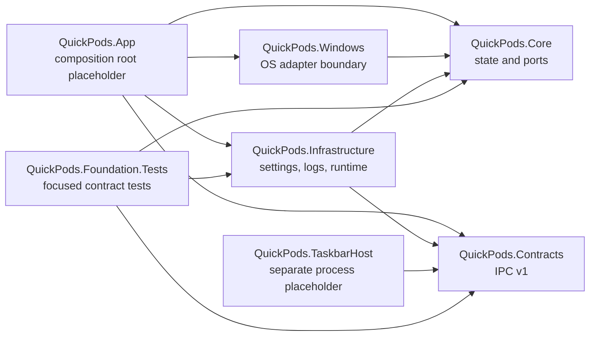

# Phase 1 — Product solution foundation

## Status

| Item | Value |
|---|---|
| Tracking | GitHub Issue #25 |
| Branch | `codex/phase-1-solution-foundation` |
| Scope | Replaceable product boundaries and contracts |
| Out of scope | Completed UI, Core Audio interop, Bluetooth KS calls, PolicyConfig calls, native taskbar hosting |

## Dependency direction

- `QuickPods.Core` and `QuickPods.Contracts` target `net10.0` and do not reference Windows interop assemblies.
- `QuickPods.Windows` is the only future owner of MMDevice, Bluetooth KS, and default-endpoint policy interop.
- `QuickPods.App` owns the product lifetime and tray in later phases. A `QuickPods.TaskbarHost` failure cannot terminate it through a project dependency.
- `QuickPods.TaskbarHost` receives versioned snapshots and returns interactions; it does not own audio or Bluetooth state.
- Spike projects remain validation evidence and are not referenced by product projects.

## Core state contract

Capability is independent for each failure domain:

- `AudioCapability`
- `TaskbarCapability`
- `DefaultOutputCapability`
- per-device `BluetoothDeviceCapability`

`StateCoordinator` serializes explicit user operations through replaceable ports. Device selection never changes OS state. A successful Bluetooth connection followed by a failed default-output change remains `Connected` plus `DefaultOutputState.Failed`; it is not collapsed into a connection failure.

The persisted `BluetoothDeviceKey` is an opaque product key. Raw Container, Endpoint, PnP, MAC, and account identifiers must not cross the Windows boundary or enter structured logs.

## IPC contract

- `ProtocolVersion = 1` is required by every envelope.
- Sequence values are non-negative and accepted only when monotonically increasing.
- State messages contain a complete taskbar snapshot rather than partial deltas, so reconnect can recover without replaying history.
- Preview and committed volume interactions are distinct and constrained to 0–100.
- Protocol mismatch is represented as a fail-closed host condition; later phases restart the host and then disable native hosting for the session after repeated failure.

## Infrastructure skeleton

- `JsonSettingsStore<T>` uses an asynchronous temporary file plus atomic replacement.
- `JsonLineLogger` writes one structured JSON event per line.
- `SingleInstanceLease` provides a per-user named-mutex ownership boundary.
- `TaskbarHostSupervisor` models start, connection, exponential backoff, and session disablement without owning the main application lifetime.

## Deferred implementation

- Phase 2 implements the Core Audio port and diagnostic WPF surface.
- Phase 3 implements raw Win32 taskbar hosting, same-user named-pipe transport, and process launch/recovery.
- Phase 4 implements the Bluetooth catalog/KS and default-output ports plus the multi-device UI.
- Phase 5 implements tray behavior, login startup configuration, settings UI, and packaging.
