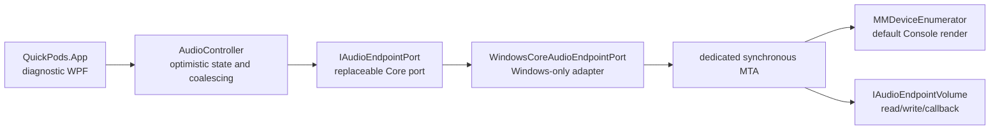

# Phase 2 — Core Audio volume MVP

## Scope

| Item | Value |
|---|---|
| Tracking | GitHub Issue #27 |
| Branch | `codex/phase-2-audio-mvp` |
| Product slice | Default Console output name, volume, mute, notifications, and recovery |
| Deferred | Tray/taskbar host, Bluetooth selection, default-output policy, packaging |

## Runtime boundary

- COM objects and raw Endpoint IDs remain on the dedicated MTA and never cross `QuickPods.Windows`.
- The Core port publishes only capability, friendly display name, integer percentage, mute, generation, and self-origin metadata.
- The application event-context GUID identifies QuickPods writes. Self callbacks are consumed by the Windows adapter but do not roll optimistic UI state backward.
- Endpoint callbacks retain their binding generation. `AudioController` rejects a retired generation after a default-device change.

## Slider write policy

The UI publishes an optimistic value immediately. `LatestVolumeWriter` waits 20 ms, writes only the newest pending percentage, and repeats only if a newer value arrived during the native call. Mouse release flushes the final value. A lock-protected transition to the completed worker state prevents a last-value race at burst completion.

## Recovery

1. `IMMNotificationClient` requests rebind on default Console output changes and active binding invalidation.
2. A rebind retires the old callback and advances generation before acquiring a new endpoint.
3. Acquisition uses bounded waits of 0, 50, 100, 250, and 500 ms.
4. If no endpoint or service is available, the adapter publishes an unavailable snapshot and schedules a two-second retry.
5. The WPF surface disables mutation controls while unavailable and remains responsive.
6. If adapter construction itself fails, the composition root supplies a service-unavailable port instead of terminating the process.

## Focused automated coverage

- scalar conversion and 0–100 clamping
- 100 rapid previews with bounded native writes and final-value commit
- stale generation rejection
- external notification update without write-back
- self-origin notification suppression during optimistic preview
- existing Phase 1 contracts and fallback isolation

Phase 0 Spike evidence remains the reference for native callback latency and long repetition. Product tests do not duplicate the removed diagnostic and test-of-test cases.
