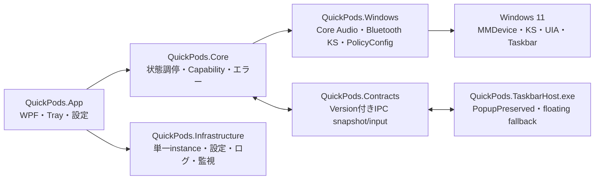

# Phase 0 — 製品実装判断

## 結論

| 項目 | 値 |
|---|---|
| Status | **Complete — Phase 1着手可** |
| 対象 | GitHub Issue #23 |
| ブランチ | `codex/phase-0-gate-decisions` |
| 判断日 | 2026-08-06 |
| Gate | Core Audio Go／Bluetooth Gate A Go／既定出力 Gate A2 Go／Taskbar Gate B Go |

QuickPods 0.1.0の必須Windows技術境界は対象環境で成立した。Phase 1は本書のプロセス境界、Capability、状態、縮退を製品契約として実装する。Phase 0のSpikeは診断・根拠として保持するが、CLIの確認トークンや検証専用出力を製品UIへ流用しない。

未解決のIssue #15、#18、#19は製品化前のP2または互換性追試であり、Phase 1開始を阻害しない。各Issueの受入条件は維持し、完了したものとして扱わない。

## 採用する製品構成



| 境界 | 採用方式 | 成功の根拠 | 不成立時の製品動作 |
|---|---|---|---|
| 音量・ミュート | 公開MMDevice／`IAudioEndpointVolume`、専用同期MTA、通知coalescing、世代破棄 | Windows UI一致、通知p95、1,000回安定性、復元 | `AudioServiceUnavailable`。有限再bindし、操作を無効化して診断を表示 |
| Bluetoothカタログ | 物理Container単位でA2DP／HFPを集約。表示名をidentityにしない | 0／1／複数／同名、選択保持、無操作更新 | 不完全な機器だけ`Unknown`／`DriverUnsupported`。他機器へ波及させない |
| Bluetooth接続・切断 | 選択Container所有のKS filter、Basic Support、隔離子プロセス、実状態観測 | Reconnect 5/5、Disconnect 5/5、誤成功0、他機器影響0 | その機器だけ直接操作を無効化し`ms-settings:bluetooth`を開く |
| 既定出力 | `IDefaultAudioEndpointPolicy`に非公開COM境界を隔離。Console／Multimediaだけ変更 | 実変更1往復、通知＋再取得、Communications不変、既定済み書込み0 | 接続は維持し`ConnectedNotDefault`、再試行と`ms-settings:sound` |
| タスクバー表示 | 別プロセスraw Win32、`SetParent`後も`WS_POPUP`維持、UIA／native二重証明 | DPI／Start／Search／入力／Explorer復旧のGate B合格 | `VerifiedNoFit`等はunowned non-topmost floating、安全geometryなしはhidden、Trayは維持 |

## Phase 1で固定する契約

### Capability

Capabilityはアプリ全体の単一booleanにしない。

```text
AudioCapability
  = Available | ServiceUnavailable | EndpointUnavailable

TaskbarCapability
  = NativeAvailable | FloatingOnly | HiddenWithTray

DefaultOutputCapability
  = Supported | PolicyUnavailable | VerificationUnavailable

BluetoothDeviceCapability (Containerごと)
  = DirectControl | SettingsOnly | OwnershipUnknown | TemporarilyUnavailable
```

`BluetoothDeviceCapability`はsnapshotごとに再評価できるが、選択の永続キーとは分離する。一つの非対応Containerで一覧全体や音量サービスを停止しない。

### Bluetooth複合状態

選択、音声接続、既定出力、操作中状態を独立して保持する。

```text
Selected + Disconnected
  -> Connecting
  -> ConnectedNotDefault
  -> SettingDefault
  -> ConnectedDefault

ConnectedDefault / ConnectedNotDefault
  -> Disconnecting
  -> Disconnected
```

- 選択と更新はOS状態を変更しない。
- KS `S_OK`だけでは`Connected`にしない。
- 既定出力失敗をBluetooth接続失敗へ畳み込まない。
- 操作中に選択またはcatalog generationが変わっても、送信済み要求の観測は完了し、古い結果を現在行へ適用しない。
- 自動再試行はAudio serviceの有限再bind等に限定し、Bluetooth KS要求とPolicyConfig書き込みは利用者の再操作を必要とする。

### プロセス・障害境界

1. `QuickPods.App`は製品状態とTrayを所有し、表示hostの異常終了で終了しない。
2. `QuickPods.TaskbarHost.exe`はPMv2、UIA watcher、native／floating surfaceを所有し、本体と別プロセスにする。
3. Bluetooth discovery／KSの停止可能な呼び出しはJob Objectで隔離し、本体スレッドを拘束しない。
4. Core AudioとPolicyConfigのCOM型、CLSIDs、生Endpoint IDは`QuickPods.Windows`から外へ出さない。
5. IPCは同一ユーザーSID、`ProtocolVersion = 1`、単調Sequence、再接続時full snapshotを必須とする。
6. ログは構造化し、生Container／Endpoint／PnP／MAC、アカウント情報を保存しない。

## エラーと縮退の最低要件

| 分類 | 表示状態 | 回復 |
|---|---|---|
| `AudioServiceUnavailable` | 音量操作不可 | 有限再bind、サウンド設定 |
| `BluetoothDriverUnsupported` | 直接操作は未対応 | Bluetooth設定 |
| `BluetoothTimeout` | 接続／切断を確認できない | 現在状態を再取得後、利用者が再試行 |
| `BluetoothSelectionStale` | 一覧が更新された | 再選択／再試行 |
| `DefaultOutputSwitchFailed` | 接続済み・非既定 | 既定化再試行／サウンド設定 |
| `NativeHostUnavailable` | floatingまたはTrayのみ | 条件を再証明して復帰 |
| `ProtocolMismatch` | host操作不可 | host再起動。連続失敗時はsession中native無効 |

## Gate根拠

| Gate | 判断 | 根拠 |
|---|---|---|
| Core Audio | Go | `core-audio/decision.md` |
| Bluetooth KS | Go | `bluetooth-ks/decision.md` |
| 既定出力 | Go | `default-endpoint-policy/decision.md` |
| Taskbar Host | Go | `taskbar-host/decision.md` |

全Gateは通常権限、x64、Windows 11 Pro 25H2 build `26200.8973`の対象環境を基準とする。別OS buildや別Bluetooth stackはCapability判定と縮退を通じて安全に扱い、互換性マトリクスはPhase 6で拡張する。

## 残存Issueの配置

| Issue | 優先度 | 実施期限 | Phase 1への影響 |
|---|---|---|---|
| #15 retained Start provenance／race hardening | P2 | Phase 3完了前 | 契約でfail-closedを保持。Phase 1 blockerではない |
| #18 UIA watcherのExplorer世代USER object増加 | P2 | Phase 3実装時、遅くともPhase 6前 | host別プロセス化はPhase 1で固定。解消は後続 |
| #19 Core Audio複数出力の物理追試 | P2 | Phase 2／6互換性試験 | 通知・世代契約は採用済み。Phase 1 blockerではない |

Phase 4では圏外、他端末接続中、Bluetooth無線OFF、再ペアリング、PolicyConfig部分状態を製品UIと設定導線を含めて検証する。Phase 6では別Windows buildとリソース安定性を扱う。Bluetoothの追加長時間反復は2026-08-07の製品判断で要求しない。

## Phase 1開始条件

- [x] 4件のGate判断がGoまたは明示的縮退として確定
- [x] 製品プロジェクトとプロセス境界が一意
- [x] Capabilityと部分状態が一意
- [x] Windows設定への縮退導線が一意
- [x] Phase 1 blockerとP2 follow-upを分離
- [x] 生OS識別子をCore／UI／IPCへ出さない方針を確定

Phase 1は`codex/phase-1-solution-foundation`を最新`main`から作成し、UI完成やWindows API本実装を混在させず、上記契約と差し替え可能な骨格だけを実装する。
