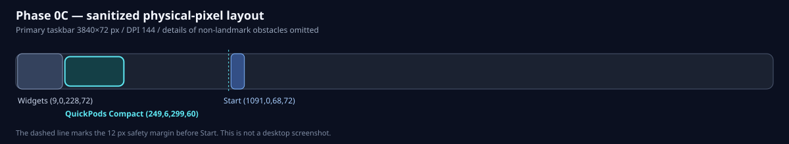

# Phase 0C／0D／0E 検証結果

## 結果概要

| 項目 | 結果 |
|---|---|
| ブランチ | `codex/phase-0e-native-continuity-spike`（Phase 0Dからstack） |
| 検証対象 | Phase 0E作業ツリー。Phase 0C／0Dの実機結果はhistorical evidenceとして継承 |
| Release build | **Pass** — 0 warning / 0 error |
| 自動試験 | **Pass** — TaskbarHost 183件、Smoke 1件、計184件。重複整理前368件から50.0%へ縮約 |
| format | **Pass** — `--verify-no-changes --severity info` |
| diff check | **Pass** — Phase 0E作業ツリー全体に空白エラーなし |
| 読み取り専用UIA探索 | **Pass（現在環境）** — Widgets ONではStart／Widgetsを一意に取得し、150%でbutton 30件、100%の検索ボックス／アイコン＋ラベルでbutton 29件・critical child 5件。Widgets OFFでは100%検索非表示でbutton 24件、アイコンのみ／ボックスで各27件、左揃えで26件 |
| UIA監視・復旧 | **Pass（Phase 0E対象経路）** — hide-first、fresh scan、NoFit再検出、Explorer再生成に加え、Start／Search中の厳格な`DirectExpected`継続を実装。単独`StartButtonMissing`以外、またはtaskbar／host identity、実親、bounds、DPI、monitor、DWM、障害物安全性の不一致では保持しない |
| floating fallback | **Partial Pass（自動合格／手動待ち）** — unowned・non-topmost、nativeとの同時表示禁止、Settings／Display／DPI時のgeometry破棄、hidden fallbackを自動試験。目視継続とclick／drag／wheelはPending |
| native promotion | **Pass（自動試験）** — 1秒cooldown、500ms以上離れた同一candidate 2回、watcher fence、hidden-prepared二段階復帰、native作成失敗3回のsession latch |
| 175%実機自動試験 | **Pass** — DPI 168、45秒EXE、Start 12秒／Search 12秒入力、exit 0、残留0。少なくとも1回`External / StructureChanged`から`NativeVisible → FloatingFallback → NativePromoted`を確認 |
| 擬似親HWND | **Pass（自動試験）** — attach、実親／PMv2検証、hide/show、親消失、通知race、破棄 |
| 透過・入力 | **Pass（機構の自動試験）** — color-key、透明corner pixel、共通slider座標、hit target、GDI解放 |
| `WS_CHILD`可視試験 | **比較完了／不採用** — 安定layoutの監視・入力には合格したが、100%のStart／Search表示中は3～10秒程度でFloatingへ退避し、要求されたnative continuityを満たさなかった |
| `WS_POPUP`可視試験 | **Pass／採用方式** — 従来の100／125%安定性に加え、Phase 0Eの120秒実機runでStart／Search表示中も同じnative位置を維持。Floating遷移0、wheel 80件、drag完了3件、正常破棄1件。ユーザー目視・入力確認も合格 |
| 100% | **Pass（試験済みPlace構成）** — 検索非表示、アイコンのみ、ボックス、アイコン＋ラベルの表示・入力・残留確認に合格。PopupはStart／Search表示中もnativeを保持しwheel入力に成功。左揃えNoFitもFail Closed |
| 検索：非表示／アイコンのみ／ボックス | **Pass（100%中央揃え）** — 3形式の安定layoutは標準要素との重なりなし。アイコンのみ／ボックスのTask View／Widgets OFF Childと、ボックスのTask View／Widgets ON Childは各1088 samplesでhidden／destroyed／rect drift 0 |
| 検索：アイコン＋ラベル | **Pass（Phase 0E／100% Popup）** — Start／Searchをそれぞれ表示した状態でnative位置を保持し、表示中のwheel入力も成功。ログ上も`DirectExpected`の保持証明が成立し、Floating遷移0 |
| 125% | **Pass（現在構成）** — `Place / Standard`。Child／Popupの17秒samplingとPopup 150回clickでhidden 0、重複・残留0。ユーザーの連続click-to-jump／ホイールでもちらつきなし。Issue #12はClose済み |
| 200% | **Pass（Fail Closed）** — Widgets ONと検索／タスクビュー／Widgets OFFの最小構成がともに`VerifiedNoFit / InsufficientWidth`。可視ホストは作成しない |
| Explorer再起動 | **Pass（現在環境／採用Popup）** — 10/10回、最大5.395秒。全回で旧View消失、新Explorer世代、View／Control各1、Popup style／実親／DWMを確認し、exit 0、残留0。200% NoFitと150%可視Childの各10回も履歴Pass |
| Explorer世代別GUI資源 | **既知P2（Issue #18）** — Popup 10回でUSER 22→32、GDI 10→10。通常HWND 5、message-only HWND 1、クラス構成は全回不変。discovery-onlyは増加0、watcher-onlyで再現し、強制GCでも不変 |
| 終了後残存 | **Pass（追加観測）** — 実行中View／Control各1、正常終了後は両HWNDとQuickPodsプロセス0 |
| Child／Popup最終方式 | **PopupPreservedを選定** — CLI既定をPopupへ変更し、Childは比較／rollback用の明示指定として保持 |

## 実行コマンドと観測

```powershell
dotnet restore QuickPods.sln --locked-mode
dotnet format QuickPods.sln --no-restore --verify-no-changes --severity info
dotnet build QuickPods.sln -c Release --no-restore -p:ContinuousIntegrationBuild=true
dotnet test QuickPods.sln -c Release --no-build --no-restore --logger "trx" --collect:"XPlat Code Coverage"
dotnet run --project spikes/QuickPods.Spike.TaskbarHost -c Release --no-build -- inspect
dotnet run --project spikes/QuickPods.Spike.TaskbarHost -c Release --no-build -- host --style child --fallback floating --duration 30 --confirm-live-host
dotnet run --project spikes/QuickPods.Spike.TaskbarHost -c Release --no-build -- host --style popup --fallback hidden --duration 30 --confirm-live-host
```

実機host検証ではapplication manifestが適用されるEXEまたは`dotnet run`を使用する。DLLを直接起動するとmanifestが適用されないため、DPI／hostの実機証跡には使用しない。

### 自動テスト・ポートフォリオの整理

2026-08-05に、実行時間と変更時のターンアラウンドを改善するため、自動テスト全体を見直した。整理前はTaskbarHost 367件とSmoke 1件の計368件、整理後はTaskbarHost 183件とSmoke 1件の計184件で、実行ケース数をちょうど50.0%へ縮約した。

- 残したもの：公開動作とfail-closed境界、Start／Search continuity、MTA／epoch、実Win32 lifecycle・ownership・DPI・handle解放、fallback／promotion、privacy sanitization
- 統合したもの：同じ分岐を繰り返すDPI中間値、Child／Popupの重複、fault enum全列挙、同値なCLI不正入力
- 除外したもの：本番経路から未使用の旧recovery／churn policyとその自己テスト、実Win32試験と重複するstyle bitmask試験、診断用formatterやテスト補助実装の自己テスト
- 運用ルール：DPI全行列は変換境界だけに置き、上位層は端点を代表とする。OS host方式の両方を実行するのは生成・親子関係の中核契約に限定する。一時的な原因切り分けprobeは恒久テストへ追加しない

整理後のRelease buildは0 warning／0 error、TaskbarHost 183件とSmoke 1件は失敗・skipとも0、formatとdiff checkも合格した。

### Phase 0D floating fallback

- native surfaceが`VerifiedNoFit`または継続的な不完全観測でfail closedとなった場合も、セッションは終了しない。直前の完全観測で検証したprimary work-area／DPIが有効なら、nativeを隠した後にunowned・non-topmost floatingへ即時退避する。safe geometryがなければ`HiddenFallback`とする。
- Start／Searchの一時的な`PrimaryTaskbarMissing`では保持geometryを捨てない。Settings／Display／DPI invalidationだけが保持geometryを破棄する。
- native復帰は1秒のmode cooldown後、500ms以上離れた同一`Place` candidateを2回観測し、fresh watcher-generation fenceを通過した場合に限る。floatingを先に隠し、検証・準備済みnativeを後から表示する。
- native作成が3回失敗した場合は、そのセッション中のnative hostingをlatch無効化する。`--duration`はsession開始から単調に測り、native／floating／hidden遷移ではresetしない。
- DPI 168（175%）でmanifest付きEXEを45秒実行し、Start入力を12秒、Search入力を12秒行った。プロセスはexit 0、終了後残留0で、少なくとも1回`External / StructureChanged`を起点に`NativeVisible → FloatingFallback → NativePromoted`を記録した。
- サニタイズ済みログは操作名を記録しないため、このPhase 0D runだけではtransitionがStart／Searchのどちらによるものかを特定できなかった。また、自動化はfloatingの目視上の継続とclick／drag／wheelを証明しなかった。100% icon＋labelの個別手動試験は後続Phase 0EでPopup native continuityとして完了した。

### Phase 0E native continuityとPopup採用

- Start／Searchを開くと、Windows側のtop-level taskbar探索と一部native child／UIA構造が一時的に変化する。Child比較runでは、fresh native証明後もUIAが単独`StartButtonMissing`となり、QuickPods自身の安全policyが3～10秒程度でFloatingへ退避した。
- 採用候補のPopupは、`SetParent`後も`WS_POPUP | WS_CLIPSIBLINGS`を維持し、`WS_CHILD`へ変換しない。実親は`GetAncestor(..., GA_PARENT)`、style、ownerなし、non-activate、DPI、bounds、visibility、DWM uncloakedを継続検証する。
- visible continuityは、完全な通常探索から得たanchorがあり、top-level列挙自体が成功して競合taskbarが0、同じtaskbarをdirect再検証できる`DirectExpected`の場合だけ許可する。UIAは単独`StartButtonMissing`だけを限定的に許可し、最後に完全取得したStartとfresh buttonを合成する。安全判定ではfresh observationと直前の完全obstaclesをunionし、既存boundsを動かさず交差0pxを再確認する。
- native notification areaの一時欠落とhostのchild列挙欠落も、Direct routeでexact taskbar／host attachmentを別経路から再証明できる場合だけ保持する。identity、class、root、process、parent、bounds、DPI、monitor／work area、visibility、DWM、style、fresh obstacle、watcher generationのいずれかが一致しなければ従来どおりhide／floatingへ退避する。
- 100%・1920×1080・中央揃えのmanifest付きPopup EXEを120秒実行した。ログは`Starting → NativeVisible`のみでFloating遷移0、`DirectExpected`とretained notification／automationの両証明に成功し、wheel 80件、drag完了3件、正常破棄1件、終了後プロセス残留0だった。
- ユーザーはStartとSearchの双方について、ウィンドウが開いている間も同じタスクバー位置を維持し、wheelでsample volumeを変更できることを目視確認した。Childが同要件を満たさずPopupだけが満たしたため、最終native styleをPopupPreservedとし、CLI既定もPopupへ変更する。Child明示指定は比較／rollback用に残す。
- `--style`を省略した6秒の境界runは`host-attached style=PopupPreserved`、exit 0、正常破棄、終了後残留0となり、CLI既定化を実プロセスでも確認した。
- 採用PopupでExplorerを10回再起動した。全回で旧View消失と新しいExplorer世代を確認し、View／Control各1、Popup style、実親、DWM uncloakedを300ms連続で再証明した。全回10秒以内で最大5.395秒、host attach／destroyは各11回、exit 0、重複・孤立・終了後残留0、Explorer 1プロセスだった。
- 同じ10回でUSER objectは22→32と世代ごとに1増えた一方、GDIは10、通常HWNDは5、message-only HWNDは1、クラス構成は不変だった。discovery-only `3→3`、watcher-only `13→14`、native／floating各20回create／destroyは増加0、強制GCでも不変だったため、managed UIA event subscriptionのprovider世代寿命に限定した。公開cleanup API以上の強制解放は行わず、Issue #18で製品化前の隔離方式を追跡する。このP2の追加診断で単体テストを再拡張しない。
- Gate B全体は、ピン留めアプリ多数、tray churn中のStart保持、および残るDPI／fallback目視項目が未完了のためPendingとする。

### Phase 0C historical evidence

- 読み取り専用探索はStartとWidgetsを一意に取得し、未知の可視native要素も障害物化して交差0pxを再検証したうえで、相対矩形`(249, 6, 299, 60)`を`Place / Compact`と判定した。初回scanはChildで102.439 ms、Popupで98.565 msだった。
- ChildとPopupの両方式で検証済み矩形へattachし、attach前後ともPer-Monitor V2／DPI 144を維持した。各30秒の実行はexit 0で終了した。
- 修正前の各方式で`External / BoundingRectangleChanged`を6回受信した。各イベント後にfresh scanを行い、同一タスクバー上の現在矩形が引き続き安全であることを確認したため、6回とも`recreated=False`で同じホストを再表示した。ただしhide／recovery自体は発生しており、後続のちらつき調査対象になった。
- UIA watcherは専用MTA thread上で登録・解除を同一threadに限定し、callbackではsender-only cacheの識別メタデータだけを読む。taskbar root配下のproperty changeと、一意なStartの直近ControlView親配下のstructure changeを監視し、subscription epochで旧rootからの遅延callbackを棄却する。既知の非Button senderによるproperty通知だけを除外し、Button、sender種別不明、およびstructure通知は安全側の無効化として維持する。
- 無効化を受けるとホストを先に隠し、watcher世代で囲ったfresh scanを終えるまで再表示しない。UIA通知を補う5秒Watchdogは、同一identity、native attachment有効、現在矩形safeをfresh scanで確認できた場合は表示を維持し、不完全・競合・unsafe時だけhide-first復旧へ移る。
- churn guardは連続10秒または30秒内6回でfail closedとする。sparse上限だけは、`External / BoundingRectangleChanged`、同一identity、fresh scanで既存矩形が安全、かつ`ShowVerifiedExisting`となる条件がすべて揃った場合に限り、そのsparse履歴をacknowledgeする。
- 200%ではWidgets ONに加え、検索／タスクビュー／Widgets OFFの最小構成でも安全幅不足を`VerifiedNoFit / InsufficientWidth`として検出し、Child／Popupともホスト作成前に終了した。最小構成の候補レーン887pxは外部native障害物で分断され、最大gap 324pxがCompact最小380pxを下回った。フォールバック判断はIssue #11で追跡する。
- 同じ200%／NoFit構成でExplorerを10回再起動した。Shell_TrayWndは約0.24～0.36秒で新しい世代へ切り替わり、UIAを含む完全観測は全回10秒以内（最大3.897秒）に復帰した。全回で同じNoFit判定を再現し、終了後の独立列挙はView／Control HWNDとQuickPodsプロセスがすべて0件だった。
- Shell_TrayWnd復帰直後の単発観測は一度`TransientUnknown`となったため、Gateの判定は製品policyと同じ250ms再試行・最大10秒で行った。これは不完全観測を成功扱いに変えたものではない。
- 検索、タスクビュー、WidgetsをOFF、中央揃えにした150%構成では、DPI 144、Start相対X 1325、UIA button 27件、native critical child 5件を取得し、相対矩形`(820, 6, 450, 60)`を`Place / Standard`と判定した。
- この150%構成でChild／Popupを各30秒実行した。独立列挙は両方式とも実行中View／Control各1、最大各1、重複0、exit 0、終了後0だった。ユーザーはChildのドラッグとホイールが正常と確認し、提供された静止画にも重なりや描画崩れは見られなかった。Popupの目視・入力所見は未回答として残す。
- 同じ150%構成で可視Childを維持したままExplorerを10回再起動した。全回でView消失、新しいExplorer世代、可視Childの再生成、非表示top-level Control 1件を独立監査し、重複は0だった。停止開始から300ms連続安定まで3.492～4.064秒、Runner内部のhide-first復旧は1.402～1.604秒で、10回とも`recreated=True`、`identity-changed=True`、`forced=True`だった。
- 再起動中に旧配置が安全でない3回は、新しいfresh scanの安全な矩形へ再生成した。残る回も新しいExplorer世代のため必ず再生成し、全10回で`current-bounds-safe`または新規配置の交差0px検証を通過した。120秒の自然終了はexit 0で、timeout 0、UIA churn fail closed 0、終了後のView／Control／QuickPodsプロセスは0、Explorerは1プロセスだった。
- 125%最小構成ではDPI 120、Start相対矩形`(1424, 0, 56, 60)`を取得し、相対矩形`(116, 5, 375, 50)`を`Place / Standard`と判定した。Childの初回30秒runは終了時刻と安全再検証が重なりexit 4でFail Closedしたが、View／Control最大各1、timeout 0、churn failure 0、残留0で、入力はwheel 180件、drag complete 31件まで正常だった。直後の再試験はexit 0、wheel 238件、drag complete 9件、残留プロセス0だった。
- 125% Popupは実タスクバーをactual parentとして検証し、View／Control各1、最大各1、重複0、wheel 208件、drag complete 24件、timeout 0、churn failure 0、exit 0、終了後View／Control 0だった。一方、ユーザーが連続click-to-jump時に時々ちらつくことを確認したため、Issue #12として原因調査と修正を行った。
- 原因は、5秒UIA scanのたびに届く`ControlType.Pane`のbounds通知と、可視ホスト自身がnative探索で`UnknownObstacle`として再列挙されるフィードバックにより、不要なhide／recoveryが発生していたことだった。whole-window blinkの主因はこの表示遷移であり、direct GDI描画にも副次的なtearリスクがあった。
- 修正では、既知の非Button senderによるproperty通知だけを除外し、native child探索から現在のlive hostと完全一致するHWNDだけを除外した。Button、未知sender、structure通知、および別HWNDは従来どおりfail closedで扱う。安定したWatchdogは表示を維持し、GDIはcompatible memory DCへ全体描画後に1回の`BitBlt`で転送するdouble bufferへ変更した。同じclamp済み音量値の再設定は再描画しない。
- 修正後の125% Popupを17秒間10ms間隔で監査し、1104 samples、View最大1、hidden interval 0、visible Watchdog 3回、recovery 0、invalidation 0、残留0を確認した。Childも同条件で1105 samples、View最大1、hidden interval 0、visible Watchdog 3回、recovery 0、invalidation 0、残留0だった。
- Popupへdirect messageを300件送るrapid-click試験ではclick complete 150回、hidden 0、visible Watchdog 3回、recovery 0、残留0だった。その後、ユーザーが同じ125%構成で連続click-to-jumpとホイールを手動確認し、ちらつきが発生しないことを確認したため、Issue #12の受入条件を満たした。
- 同じ最小タスクバー設定の100%構成では、読み取り専用探索が`discoveryComplete=true`、`faults=[]`で完了した。タスクバーは3840×48 physical px、DPI 96、Start相対矩形は`(1568, 0, 45, 48)`、UIA button 24件、native critical child 5件で、相対矩形`(190, 4, 300, 40)`を`Place / Standard`と判定した。
- 100% Popupを17秒間、起動時に確定した同一HWNDで監視し、1087 samples、hidden／destroyed／rect drift 0、最終View 1を確認した。入力ログはinteraction start／complete 49／49、`DragMoved` 593件、`Wheel` 205件、verified-visible Watchdog 23回で、invalidation／recovery／churnは0だった。ユーザーのclick／drag／wheelと表示の手動確認もすべて良好だった。
- 100% Childも同じ固定HWND方式で17秒間監視し、1089 samples、hidden／destroyed／rect drift 0、最終View 1を確認した。入力ログはinteraction start／complete 50／50、`DragMoved` 506件、`Wheel` 515件、verified-visible Watchdog 11回で、invalidation／recoveryは0だった。ユーザーの手動確認でもちらつき、入力、表示に問題はなかった。
- 100%のChild／Popupを各6秒で再実行した終了試験は、両方式ともexit 0、fatal 0だった。終了後の独立列挙ではView／Control HWNDとQuickPodsプロセスがすべて0件だった。
- その後100%のまま、検索非表示、Task View OFF、Widgets OFF、左揃えへ変更した構成を探索した。タスクバーは3840×48 physical px、DPI 96、Start相対矩形は`(0, 0, 45, 48)`、UIA button 26件、native critical child 4件だった。探索は`discoveryComplete=true`、`faults=[]`で完了したが、安全幅不足のためboundsなしの`VerifiedNoFit / InsufficientWidth`となった。
- この100%左揃え構成でChild／Popupを起動すると、両方式ともホスト作成前にexit 3で終了した。終了後の独立列挙はView／Control HWNDとQuickPodsプロセスがすべて0件であり、推測配置しないFail Closedは期待どおりだった。これはネイティブ表示の成功ではなく、左揃えではフォールバックが必要になる証跡である。
- 100%のまま中央揃えへ戻し、検索アイコン、Task View OFF、Widgets OFFとした構成では、タスクバー3840×48 physical px、DPI 96、Start相対矩形`(1502, 0, 45, 48)`、UIA button 27件、native critical child 5件、fault 0を取得し、相対矩形`(173, 4, 300, 40)`を`Place / Standard`と判定した。Childの17秒固定HWND監視は1088 samples、hidden／destroyed／rect drift 0だった。入力ログはinteraction start／complete 31／31、move 458件、wheel 285件、Watchdog 11回、invalidation／recovery 0で、終了後のView／Control HWNDとQuickPodsプロセスも0件だった。ユーザーはちらつき、標準要素との重なり、表示、入力のすべてに問題がないことを確認した。
- 続いて検索ボックス、中央揃え、Task View OFF、Widgets OFFとした100%構成では、Start相対矩形`(1412, 0, 45, 48)`、UIA button 27件、native critical child 5件、fault 0を取得し、相対矩形`(151, 4, 300, 40)`を`Place / Standard`と判定した。Childの17秒固定HWND監視は1088 samples、hidden／destroyed／rect drift 0だった。入力ログはinteraction start／complete 10／10、move 295件、wheel 159件、Watchdog 11回、invalidation／recovery 0で、終了後残留も0件だった。ユーザーの手動確認でもちらつき、重なり、表示、入力のすべてに問題はなかった。
- Task ViewとWidgetsをONにした100%中央揃えの検索ボックス構成でも、Start相対矩形`(1390, 0, 45, 48)`、Widgets相対矩形`(6, 0, 152, 48)`、UIA button 29件、native critical child 5件、fault 0を取得し、相対矩形`(264, 4, 300, 40)`を`Place / Standard`と判定した。Childの17秒固定HWND監視は1088 samples、hidden／destroyed／rect drift 0だった。入力ログはinteraction start／complete 28／28、move 354件、wheel 70件、Watchdog 11回、invalidation／recovery 0で、ユーザーの表示・入力確認も良好、終了後残留0だった。
- 同じ100%中央揃えで検索をアイコン＋ラベル、Task ViewとWidgetsをONにした初期探索はcomplete、fault 0だった。Start相対矩形は`(1449, 0, 45, 48)`、Widgetsは`(6, 0, 152, 48)`、UIA button 29件、native critical child 5件で、相対矩形`(1028, 4, 300, 40)`を`Place / Standard`と判定した。初期描画と入力はユーザー目視で良好だった。
- ただし、Start／Windows一時UIと検索アイコン＋ラベルの検索一時UIは、どちらもタスクバー観測が一時的に`PrimaryTaskbarMissing`となる同じ事象を再現した。再現区間の外部inspectは57/57回が`TransientUnknown / IncompleteObservation`で、Runnerは推測配置せずhostを安全にhideした。隔離した制御runではStartが7.796秒、検索が6.757秒で同じhostへ復帰した一方、観測不能が10秒を超えると既存のFail Closed timeoutに達する。
- Issue #13の切り分け用に、探索完了、配置decision／reason、fault code、UIA button／native critical child件数、scan中のinvalidation、exact live-host除外一致のboolだけを保持するサニタイズ済みscan signatureを追加した。同一signatureの連続retryは初回と反復回数へ集約し、反復要約を復帰／timeout結果より先に出力する。raw HWND、PID、表示名、Automation ID、座標は出力しない。予期しないUIA側失敗でも、Win32探索済みのhost除外一致boolを失わない。
- Phase 0Cでは、10秒未満の制御runはプロセスが存続したまま安全にhideし、10秒超ではSpikeが意図したFail Closedとして終了した。renderer／input flickerや予期しない即時クラッシュではないが、ユーザーにはどちらも「落ちた」ように見える復帰UXの問題だった。この終了動作はPhase 0Cのhistorical evidenceであり、Phase 0Dではfallbackへ遷移してセッションを継続する。
- 音量とBluetoothの状態は読み取りも変更もしていない。Explorer再起動はユーザー許可のGate B試験だけで行い、表示倍率とタスクバー設定はユーザーがWindows設定から変更した。Spike自身はExplorer再起動や設定変更を実行しない。

### 150%／WS_CHILD可視ホストのExplorer復旧

| Cycle | 外部監査の復旧時間 | Runner内部の復旧時間 |
|---:|---:|---:|
| 1 | 4063.743 ms | 1603.729 ms |
| 2 | 3542.965 ms | 1404.785 ms |
| 3 | 3491.972 ms | 1425.960 ms |
| 4 | 3527.358 ms | 1446.234 ms |
| 5 | 3548.686 ms | 1443.521 ms |
| 6 | 3544.118 ms | 1401.675 ms |
| 7 | 3493.850 ms | 1419.901 ms |
| 8 | 3671.977 ms | 1432.558 ms |
| 9 | 3626.727 ms | 1488.543 ms |
| 10 | 3645.586 ms | 1517.309 ms |

外部監査時間はShell停止直前から、新しいExplorer世代の配下でView 1件と、非表示top-level Control 1件を300ms連続して確認するまでを測った。全cycleで旧Viewの消失、新しいExplorer世代、`recreated=True`、`identity-changed=True`、`forced=True`を確認した。生PIDとHWNDは実行中比較にだけ使用し、保存していない。

外部監査は接続、可視性、現Shellとの親子関係、一意性、残留を独立検証したもので、UIA安全領域を再計算してはいない。各cycleの配置安全性はRunner内部のfresh complete scan、`SafeRegionCalculator`の最終交差検証、およびnative側の実bounds／parent／DPI検証を根拠とする。世代ごとの推奨X座標変化は、旧矩形がunsafeなら安全な新矩形へ再生成し、旧矩形がsafeならsticky placementで不要な移動を抑えるpolicyどおりだった。

Childの150%での静止画とドラッグ／ホイール、および125%両方式の入力ログは確認済みで、Issue #12はClose済みである。100%の検索非表示／アイコンのみ／ボックス、およびTask View／Widgets ON検索ボックスは固定HWND監視、入力ログ、ユーザー手動確認、終了後残存0に合格し、100%左揃えNoFitもFail Closedに合格した。Phase 0Eでは100% PopupでStart／Search双方のnative continuityと表示中wheel入力に合格し、PopupPreservedを最終方式に選定した。採用PopupのExplorer再起動10回も機能要件に合格し、UIA watcherの世代別資源寿命はIssue #18へ分離した。ピン留めアプリ多数、tray churn、および残るDPI／fallback目視項目が未完了のため、Gate BをGoとして扱わない。

以下は実画面を含まないサニタイズ済み配置図である。実画面スクリーンショットの代替ではなく、相対座標証跡の確認用とする。


